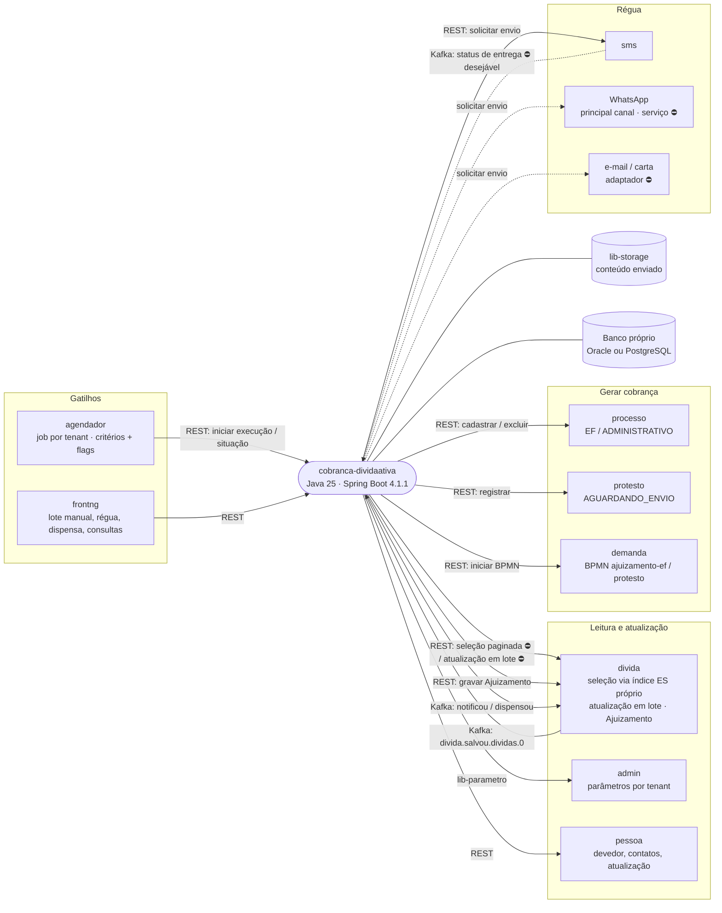
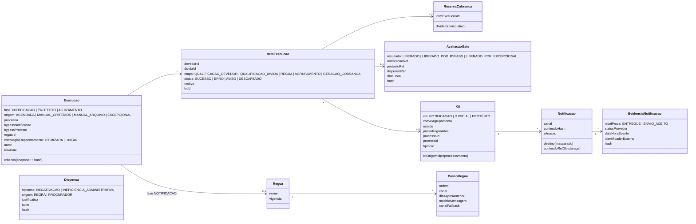
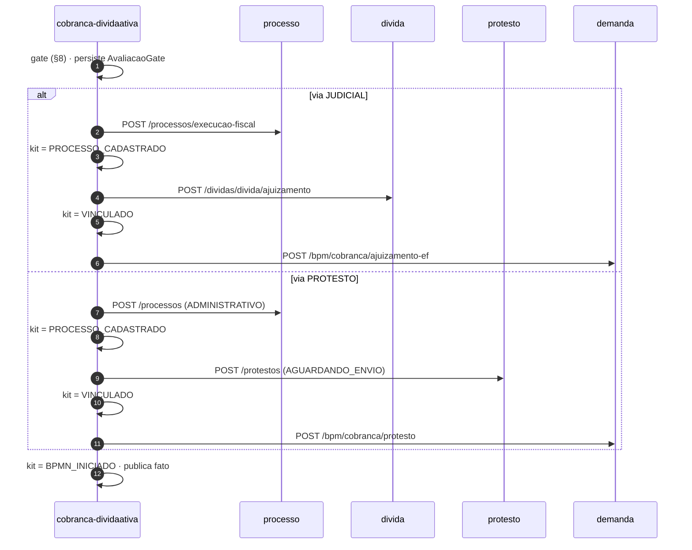
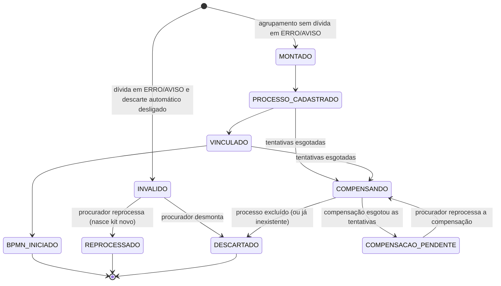
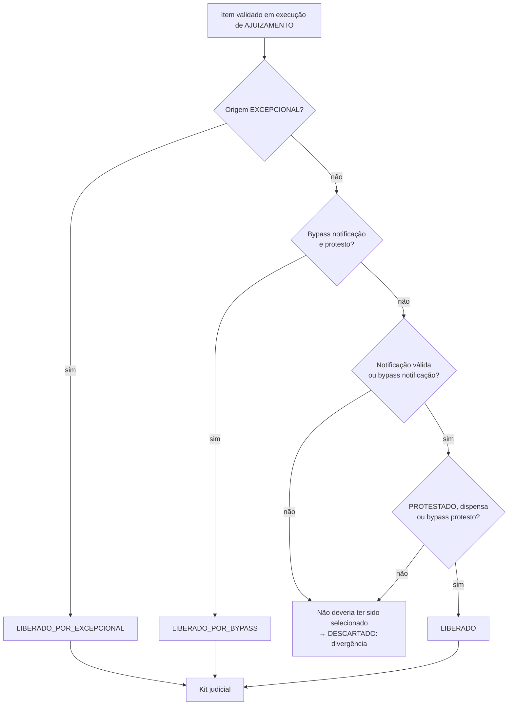

# ARCHITECTURE.md — cobranca-dividaativa (Java 25)

> **Como** o serviço é construído. O **quê** e o **porquê** (visão, escopo, regras legais, anti-objetivos)
> estão no [`PROJECT.md`](PROJECT.md); este documento não os repete, aponta para eles.
>
> **Status:** arquitetura-alvo, revisada em 26/09/2026 após a rodada de decisões com o time. Fontes:
> `PROJECT.md`, [inventário de paridade](docs/inventario-paridade/README.md) e levantamento read-only
> dos contratos dos serviços vizinhos. O código ainda não existe (`src/` contém apenas o esqueleto).
>
> **Legenda:** ✅ decidido · ⛔ dependência externa (trabalho em outro serviço) · ❓ em aberto.
>
> Regra do projeto (`AGENTS.md`): **não inferir.** Onde este documento diz ❓, a implementação para e pergunta.

---

## 1. Visão executiva

### 1.1 Em uma frase

Cada **execução** faz **uma fase** da cobrança — notificação (régua), protesto ou ajuizamento — sobre
as dívidas que a consulta ao `divida` devolve como aptas para aquela fase. Protesto e ajuizamento
passam pelo **gate CNJ 547** (salvo bypass ou excepcional), agrupam as dívidas em kits, cadastram
processo/protesto, gravam o vínculo na dívida e **iniciam o BPMN na `demanda`**.

### 1.2 Contexto (C4 nível 2)

Setas sólidas: contratos existentes ou que este serviço publica. ⛔: contrato que precisa ser criado
em outro serviço (§14).

### 1.3 Quadro de decisões

| # | Decisão | Seção |
|---|---|---|
| A1 | Nome `cobranca-dividaativa`, pacote `ai.attus.cobrancadividaativa`, prefixo de tópicos `cobranca-dividaativa.` | §2 |
| A2 | Banco Oracle **e** PostgreSQL; migrations portáveis (ADR java 0006) | §11 |
| A3 | Execução **por fase** (notificação, protesto ou ajuizamento); modo encadeado é evolução pós-virada | §4 |
| A4 | Modelo `Execucao` + `ItemExecucao`; **sem** estado de longa duração por dívida no serviço. O estado entre fases (notificada, dispensada, protestada) fica indexado no `divida` | §3 |
| A5 | Seleção via **API do `divida`**, que consulta o próprio índice. Sem bypass, a consulta **filtra as condições da fase** (dívida inapta nem retorna) | §5.1, §9.1 |
| A6 | Pipeline de protesto/ajuizamento: qualificação de devedor → qualificação de dívida → agrupamento → gerar cobrança. Notificação: qualificação de devedor → qualificação de dívida → agrupamento (kit de notificação, 28/09/2026) → régua | §5 |
| A7 | Transição entre etapas **via Kafka**, com **um tópico por etapa** (28/09/2026), 1 mensagem por **bloco** (1 por **kit** em gerar cobrança); filas **prioritárias** para execução com lista explícita | §5.5, §10 |
| A8 | Chamadas a outros serviços por **REST síncrono** onde o contrato só existe assim; gerar cobrança com **SAGA persistida** por kit | §7 |
| A9 | Atualização do devedor pelas **flags `higienizar`/`enriquecer` dos critérios** (27/09/2026); da dívida **por parâmetro**; dívida atualizada **em lote** no `divida`. Validação completa após atualizar; sem atualização, só o que a consulta não cobre. **Falha na atualização do devedor para o devedor** em `ERRO` na qualificação de devedor, sem seguir para as dívidas (28/09/2026) | §5.2 |
| A10 | Régua em **tabelas próprias**, cadastrada pelo procurador; N réguas por tenant; o ciclo segue **todos os passos** (28/09/2026) — o primeiro aviso válido notifica e libera a reserva, a régua continua em paralelo | §6 |
| A11 | Prova da notificação com **nível por canal**: entregue (canal com confirmação) × envio aceito (sem confirmação). DLR desejável, não bloqueante | §6.3 |
| A12 | Gate: notificação válida — **sem validade**, vale para sempre (28/09/2026) — + protesto `PROTESTADO` ou dispensa | §8 |
| A13 | **Bypass** = flags nos critérios, sem justificativa, privilégio checado ao salvar o job; **excepcional** ignora gate e situação | §8.2, §8.3 |
| A14 | Interrupção por `divida.salvou.dividas.0` (encerrada, `PARCELADA`, `SUSPENSA`); parciais continuam | §5.4 |
| A15 | Publicação Kafka dentro de `@Transactional` (sincronia send + commit, ADR comum 0005), **sem outbox** — condicionada à verificação na `lib-messageria` | §10.3 |
| A16 | Regras de paridade R1–R6 fechadas | §5.3 |
| A17 | Drenagem **por tenant** pelo roteamento do `agendador` | §13 |
| A18 | Evidência append-only com hash; **sem expurgo** na 1ª entrega | §11.2 |
| A19 | **Ajuizamento 4.0 / grande porte na 1ª entrega** (27/09/2026): unidade judicial especial definida no agrupamento, com a regra do `divida` | §5.3 |
| A20 | Kit com dívida em falha segue `DESCARTAR_AUTOMATICAMENTE_DIVIDAS_INVALIDAS_DO_KIT_HABILITADO` (regra do `kitcobranca`, escolha explícita de 27/09/2026): ligado ⇒ a dívida em falha é descartada com motivo e o kit segue com as demais; desligado ⇒ o kit inteiro é invalidado. Dívida em falha (item com status `ERRO` ou `AVISO`) **não é descartada na etapa que falhou**: segue marcada até o agrupamento, onde o parâmetro decide. O descarte fica no agrupamento, e não na etapa que falhou, para o procurador poder reprocessar o kit depois que a causa for resolvida (ex.: serviço de atualização fora do ar). **Não** vale para dívida já ajuizada detectada na geração: é descarte por regra, o kit segue sem ela (Q-11, §7). `DEVE_GERAR_COBRANCA_QUANDO_DIVIDA_NO_LOTE_COM_ERRO` do `divida` **não é portado** | §5.3, §7 |
| A21 | **Status do item = etapa + status** (27/09/2026). Etapas: `QUALIFICACAO_DEVEDOR`, `QUALIFICACAO_DIVIDA`, `REGUA` (só na fase de notificação), `AGRUPAMENTO`, `GERACAO_COBRANCA`. Status: `SUCESSO`; `ERRO` = algo deu errado, mas pode ser corrigido; `AVISO` = não há o que fazer, é só um aviso; `DESCARTADO` = saiu da execução, com motivo | §3, §4 |
| A22 | **Reprocessamento em dois níveis**, pelo mesmo usuário que pode iniciar a execução, **reabrindo a execução original** (27/09/2026): **devedor** em `ERRO` volta à qualificação de devedor e refaz a consulta das dívidas; **kit `INVALIDO`** volta à qualificação de dívida com as mesmas dívidas (menos as removidas pelo procurador), sempre revalidadas; o kit antigo fica `REPROCESSADO` e nasce kit novo ligado a ele. Dívida sozinha não é reprocessável. Kit `INVALIDO` também pode ser **desmontado**. Na saga: retry automático até o parâmetro geral de tentativas; esgotado, compensa e o kit fica `DESCARTADO`; compensação que falha deixa `COMPENSACAO_PENDENTE`, cuja única ação é reprocessar a compensação | §7, §7.1 |
| A23 | **Notificação por kit** (28/09/2026): a fase de notificação tem etapa de **agrupamento**; o devedor é notificado por um grupo de débitos. O grupo é um `Kit` com via `NOTIFICACAO`, mesma chave de agrupamento do ajuizamento (R2), mesma regra de dívida em falha (A20) e mesmo reprocessamento/desmontar (A22). A régua roda **por kit**; dívida retirada sai do kit e o kit segue com as demais. Na notificação **não há limites de kit** (quantidade, valor mínimo/máximo) e a estratégia de empacotamento não se aplica: um kit por chave (Q-15) | §5.3, §6 |

---

## 2. Premissas e restrições técnicas

- **Stack:** Java 25, Spring Boot 4.1.1, Gradle, pacote `ai.attus.cobrancadividaativa` (A1).
  Renomear `settings.gradle`, `spring.application.name`, pacote atual (`ai.attus.cobranca`) e o
  comando do `AGENTS.md` é tarefa do roadmap.
- **Plataforma:** `attus-platform-bom` com `lib-core`, `lib-database`, `lib-messageria`,
  `lib-parametro`, `lib-security`, `lib-auditoria`, `lib-storage`, `lib-cache` e `lib-utils`, como o
  `kitcobranca` (`kitcobranca/build.gradle`). `lib-action` **só** se a borda de lote precisar dela
  (`PROJECT.md` §6); nenhum estado de domínio mora em estrutura da lib. A compatibilidade do BOM com
  Spring Boot 4.1.1 precisa ser verificada (o `kitcobranca` usa 4.0.3).
- **Entidades** herdam `EntityAudit` (auditoria, `@Version`, `@Multitenant`; ADR java 0018).
  JPQL `UPDATE` ignora `@Version`: não usar em entidade de domínio versionada.
- **GraalVM native** desejável, não obrigatório; motivo registrado aqui se cair para JVM.
- **Camadas:** Controller → Component → Service → Repository → Mapper (ADR java 0001), PT-BR, BDD (ADR java 0008).
- **Agendamento** só pelo `agendador` (ADR java 0021). Nenhum `@Scheduled`.
- **Parâmetros** pelo `admin` (ADR comum 0010).

---

## 3. Modelo de domínio

| Conceito | Papel | Observação |
|---|---|---|
| `Execucao` | Um disparo de **uma fase** | Snapshot imutável dos critérios (incl. flags de bypass) com hash, autor e data. Prioritária quando os critérios trazem lista de documentos de devedor ou números de dívida |
| `ItemExecucao` | A dívida (ou, para devedor informado não selecionado, o devedor pelo **documento informado**, sem dívida) dentro da execução: **etapa** + **status** (`SUCESSO`, `ERRO`, `AVISO`, `DESCARTADO`) + motivo (A21). `ERRO`/`AVISO` não tiram a dívida da execução; o agrupamento decide (A20) | Execução de notificação dura enquanto a régua roda (dias); protesto/ajuizamento terminam ao gerar a cobrança |
| `ReservaCobranca` | Exclusividade: a dívida está em no máximo uma execução ativa (P8) | Restrição única no banco. A reserva vale **enquanto a execução estiver ativa**: é liberada quando o item sai da execução (`DESCARTADO`) ou quando a execução termina — inclusive para as dívidas de kit `INVALIDO`, que a partir daí podem ser pegas por outra execução (por isso o reprocessamento revalida). Na **notificação**, a reserva é liberada no **primeiro aviso válido**: a dívida segue na régua em paralelo e fica livre para protesto/ajuizamento (28/09/2026, §6.2). Exceção: bypass/excepcional tomam a dívida ainda **não notificada** de uma execução de notificação em andamento (§6.4) |
| `Regua` / `PassoRegua` | Pipeline da fase de notificação | Tabelas próprias (A10); o `admin` guarda só limites globais (domínios oficiais) |
| `Notificacao` / `EvidenciaNotificacao` | O que foi enviado e o que o provedor informou | Append-only; nível de prova explícito (A11) |
| `Dispensa` | Substitui o protesto | Negativação por regra; ineficiência por procurador com justificativa. Averbação/bens à penhora na 2ª entrega |
| `AvaliacaoGate` | Registro de cada liberação para ajuizamento, com as provas ou o escape usado | Append-only; juntável à inicial (§9.3) |
| `Kit` | Unidade enviada ao BPMN (via `JUDICIAL`/`PROTESTO`) ou unidade notificada pela régua (via `NOTIFICACAO`, A23) | Entidade própria com estado explícito — nunca `Map<String,String>` (lição do `kitcobranca`) |

**Por que não há estado de longa duração por dívida (A4):** com execução por fase e o índice do
`divida` guardando notificação, dispensa e protesto, "em que ponto a dívida está" é derivado desses
fatos. A linha do tempo da dívida é reconstruível a partir de execuções e evidências.

---

## 4. Execução por fase

| Fase | Etapas | Termina quando |
|---|---|---|
| `NOTIFICACAO` | qualificação de devedor → qualificação de dívida → agrupamento → régua | todos os kits de notificação com o ciclo concluído (`REGUA_CONCLUIDA`), descartados ou aguardando ação do procurador (`INVALIDO`) |
| `PROTESTO` | qualificação de devedor → qualificação de dívida → agrupamento (1 CDA) → gerar cobrança | todos os kits em estado final (`BPMN_INICIADO`, `DESCARTADO`, `REPROCESSADO`) ou aguardando ação do procurador (`INVALIDO`, `COMPENSACAO_PENDENTE`) |
| `AJUIZAMENTO` | qualificação de devedor → qualificação de dívida → agrupamento → gerar cobrança | idem |

Origens: `AGENDADA` (`agendador`), `MANUAL_CRITERIOS`, `MANUAL_ARQUIVO` (CSV com uma coluna por critério de lista — `numero_cda`, `processo_inscricao`, `documento_devedor` —, combinadas por E; Q-08)
e `EXCEPCIONAL` (1 dívida, sempre ajuizamento, sempre prioritária).

**Item = etapa + status (A21).** A etapa avança conforme a fase; em cada etapa o status é:

| Status | Significado | Efeito |
|---|---|---|
| `SUCESSO` | a etapa concluiu | segue para a próxima etapa |
| `ERRO` | algo deu errado, **mas pode ser corrigido** (ex.: serviço fora do ar) | segue marcado até o agrupamento (A20); reprocessável pelo devedor ou pelo kit (§7.1) |
| `AVISO` | **não há o que fazer**, é só um aviso | segue marcado até o agrupamento (A20); reprocessar não resolve, por isso o procurador pode reprocessar o kit excluindo essas dívidas |
| `DESCARTADO` | saiu da execução, com motivo (regra de seleção, interrupção, régua esgotada, kit desmontado…) | final; reserva liberada |

Mapeamento dos antigos: `NOTIFICADO` = `REGUA`/`SUCESSO`; `NAO_NOTIFICADO` = `REGUA`/`DESCARTADO` ("régua esgotada");
`ENCAMINHADO` = `GERACAO_COBRANCA`/`SUCESSO`; `RETIRADO` = `DESCARTADO` com o motivo da retirada.

**Reprocessamento reabre a execução original** (A22): `CONCLUIDA_COM_FALHAS` → `PROCESSANDO`, com o mesmo snapshot de critérios.

Contrato para o `agendador` (que hoje faz polling, `agendador/.../CobrancaJob.java:114-148`):
`POST /execucoes` devolve o id; `GET /execucoes/{id}/situacao` informa conclusão; parar por `jobId`
e encerrar execuções do tenant (P27).

**Modo encadeado** (uma execução atravessa várias fases): evolução pós-virada, raro entre clientes.
Reusa o mesmo motor; não entra na 1ª entrega.

---

## 5. Pipeline das etapas

### 5.1 Seleção de devedores e de dívidas

| Etapa | Passos |
|---|---|
| **Qualificação de devedor** | busca no ES (via `divida`, paginada por cursor) → atualização do devedor (se flags `higienizar`/`enriquecer` dos critérios; via `pessoa`) → validação |
| **Qualificação de dívida** | busca no ES (via `divida`) → atualização da dívida **em lote** (se `INTEGRACAO_ATUALIZA_TODA_DIVIDA`) → validação |

Filtros aplicados **na consulta** (sem bypass), por fase:

| Fase | Filtro de condição |
|---|---|
| `PROTESTO` | notificação válida (sem validade: vale para sempre) · sem protesto ativo |
| `AJUIZAMENTO` | notificação válida · protesto em `PROTESTADO` **ou** dispensa **ou** negativada (índice do `divida`) |
| `NOTIFICACAO` | não estar em kit de notificação `EM_REGUA` (verificado **neste serviço** na qualificação de dívida: descarte por regra "já em régua"; 28/09/2026) |
| todas | não ajuizada · protesto não em `PAGO`/`ENVIADO_PARA_CARTORIO` · critérios do job (valores, datas, tributo…) |

Com bypass de notificação e/ou protesto, a consulta omite o filtro correspondente.

**Lista explícita (28/09/2026):** o procurador que informa devedores ou dívidas tem uma **expectativa** e precisa ver o
que não foi selecionado; sem lista, não há conciliação. Com lista de **devedores** (documentos), cada devedor informado
ausente vira item `DESCARTADO` com motivo ("devedor não encontrado", critério de devedor não atendido ou "sem dívidas
aptas para a fase"; F-005 RF-10). Com lista de dívidas (critérios ou CSV), a lista informada é conciliada com o
resultado da consulta: cada dívida informada ausente vira item `DESCARTADO` com o motivo do primeiro critério que
não cumpre (reaplicando validadores e condições de fase sobre os dados buscados sem filtro), "dívida não encontrada"
ou "devedor descartado". Nenhuma dívida informada some sem motivo (F-006 RF-12; paridade `divida` C6, `cobranca` C17). O excepcional não
passa pela consulta: recebe 1 dívida e só verifica se já está ajuizada.

### 5.2 Atualização e validação (A9)

- **Atualização do devedor:** **não é parâmetro** (decidido em 27/09/2026). Os critérios da execução
  trazem as flags `higienizar` e `enriquecer`, como no `CriteriosSelecaoCobranca` do `divida` e do
  `cobranca` legado; com qualquer uma ligada, chama `PUT /pessoas/{id}/enderecos/higienizacao-ajuizamento?enriquecer=<flag>`
  no `pessoa`. `enriquecer` consulta a Receita Federal (e demais bases de enriquecimento); `higienizar`
  só higieniza o endereço. Falha na atualização do devedor (ex.: `pessoa` fora do ar) **para a esteira do devedor** (28/09/2026): o devedor fica `ERRO` na etapa `QUALIFICACAO_DEVEDOR` (motivo "falha na atualização do devedor"), suas dívidas **não são consultadas** e nenhum kit é gerado. O erro é do devedor, não do kit: o reprocessamento do devedor recomeça do mesmo ponto, sem desfazer kits (F-016).
  Falha de **dívida** (atualização em lote) continua como abaixo: `ERRO` que segue até o agrupamento (A20).
- **Atualização da dívida:** por `INTEGRACAO_ATUALIZA_TODA_DIVIDA` (os parâmetros
  `SINCRONIZAR_DIVIDA_COM_INTEGRACAO_AO_PREPARAR_COBRANCA` e `SINCRONIZAR_DIVIDA_COMPLETA_AO_ATUALIZAR_VALORES`
  são transitórios e não entram). Em **lote**: o serviço envia as dívidas do bloco e o `divida`
  itera. Condições: tamanho limitado ao bloco; resultado **por dívida** (falha de uma não derruba
  as outras). Dívida cuja atualização falhou **não é descartada**: o item fica com
  status `ERRO` (motivo "falha na atualização") e segue até o agrupamento (A20). ⛔ endpoint novo (hoje só `PUT /dividas/{id}/cobranca`, uma por vez).
- **Validação:** cada validador declara se **já é garantido pela consulta** (ex.: situação da
  dívida) ou não (ex.: bloqueio de cobrança). Dívida atualizada → **todos** os validadores.
  Sem atualização → só os não cobertos pela consulta.

### 5.3 Regras de paridade (A16)

Paridade real = caminho ativo: `divida` para ajuizamento, `cobranca` legado para protesto.

| # | Tema | Regra decidida |
|---|---|---|
| R1 | Protesto `PAGO` / `ENVIADO_PARA_CARTORIO` | **impede** a seleção |
| R2 | Agrupamento | chave fixa **`devedorId` + `orgaoOrigemId`**, mais as flags opcionais do job (`agrupaIdentificadorDebito`, `agrupaCategoria`, `agrupaAutoInfracao`). Com `agrupaRaizCnpj`, `devedorId` **sai** e entra **raiz do CNPJ** (processo contra o menor CNPJ) |
| R3 | Valor mínimo no protesto | critério do job (vazio = sem limite), aplicado na seleção |
| R4 | Bloqueio de cobrança | dívida/devedor bloqueado **não é selecionado**; motivo no sumário. CRUD fica no `divida` |
| R5 | Revalidação após atualizar | regra do §5.2, sem parâmetro próprio |
| R6 | Empacotamento quando o grupo passa dos limites | estratégias do `kitcobranca` portadas como critério do job: `OTIMIZADA` (padrão; mais kits válidos, menos dívidas de fora) e `LINEAR` (enche em ordem; sobras abaixo do mínimo ficam de fora). Dívidas de fora saem com motivo "não atingiu valor mínimo do kit" |
| — | Kit de protesto | **1 CDA = 1 protesto** |
| — | CPF/CNPJ inválido | **bloqueio fixo** em protesto e ajuizamento (excepcional ignora) |
| — | Endereço do devedor inconsistente (sem principal, sem município, inválido para citação quando não passível de ajuizamento) | descarta em protesto e ajuizamento **sob `VALIDAR_ENDERECO_CONSISTENTE_GERACAO_KIT_AJUIZAMENTO`** (mantém o comportamento do `divida`); não vale na notificação nem no excepcional |
| — | Tipo de pessoa, valor mínimo ajuizado, situação do devedor PJ | critérios do job aplicados como filtro na consulta ao `divida` |
| — | Kit com dívida em falha | `DESCARTAR_AUTOMATICAMENTE_DIVIDAS_INVALIDAS_DO_KIT_HABILITADO` (`kitcobranca` `AgrupadorDividasService.java:140-155`, `ValidadorKitDividasComErro.java`): ligado ⇒ descarta a dívida em falha e o kit segue; desligado ⇒ kit invalidado inteiro (A20). Substitui `DEVE_GERAR_COBRANCA_QUANDO_DIVIDA_NO_LOTE_COM_ERRO` do `divida` |
| — | Parâmetros e critérios sem efeito hoje | **não portados**; critério novo entra sob demanda |
| — | Simulação | 2ª entrega |
| — | Hardcodes por tenant (Q-02, 28/09/2026) | PGMCABO 179 `NOT_REQUIRED` (só no arquivo de retorno, descontinuado); espera de 2 s da PGEPA **não portada** (sem `Thread.sleep`; freio por tamanho de bloco/concorrência); participações 143/168 do processo ADMINISTRATIVO viram parâmetros `ID_TIPO_PARTICIPACAO_CONTRARIA_PROCESSO_ADM`/`ID_TIPO_PARTICIPACAO_REPRESENTADA_PROCESSO_ADM` (precedente `kitcobranca`) |
| — | Ajuizamento 4.0 / grande porte | **entra na 1ª entrega** (A19, 27/09/2026): regra do `divida` (inventário C10, `RegraAjuizamentoQuatroPontoZero`), ligada por tenant em `INSTITUICAO_PERMITE_AJUIZAMENTO_UNIDADE_JUDICIAL_ESPECIAL` |

### 5.4 Interrupção (A14)

- Consumer de `divida.salvou.dividas.0` (payload `DividaDto` com `situacaoAtual`,
  `divida/.../dto/DividaDto.java:56-154`). Retiram o item de execução ativa: `LIQUIDADA`,
  `CANCELADA`, `ANISTIADO`, `PREESCRITO`, `PARCELADA`, `SUSPENSA`. Situações **parciais continuam**
  pelo saldo. Kit de protesto/ajuizamento `MONTADO`, em saga ou `INVALIDO` é **desmontado** e as demais dívidas
  são descartadas com motivo; no kit em saga, desmontar é compensar (§7). Kit com BPMN iniciado não é afetado (Q-19, 28/09/2026).
- O consumer descarta rápido o que não tem `ReservaCobranca` ativa **nem item em kit de notificação `EM_REGUA` nem em kit `INVALIDO`** — dívida notificada segue na régua sem reserva (§6.2) (ADR comum 0005: filtrar no consumer).
- Antes de cada **passo da régua** (execução longa), a situação é reconsultada.
- `parcelamento` e `debito` não publicam fatos; a interrupção depende do reflexo da situação no `divida`.
- Excepcional ignora a interrupção por situação (§8.3).

### 5.5 Mensageria entre etapas (A7)

| Etapa | Mensagem |
|---|---|
| Qualificação de devedor | 1 por bloco de devedores (página da consulta) |
| Qualificação de dívida | 1 por bloco (o mesmo recorte de devedores), no tópico da etapa |
| Agrupamento | 1 por bloco; partição por chave de agrupamento (devedor ou raiz CNPJ); vale também para a notificação (A23) |
| Gerar cobrança | 1 por **kit** (isola falha e retry) |
| Passo da régua | 1 por bloco de envios do passo (1 envio = 1 kit de notificação) |

**Cada etapa tem tópico e consumer próprios** (28/09/2026): no `kitcobranca`, um tópico único para todos os blocos
fazia a etapa mais lenta limitar a vazão das demais. Tamanho do bloco e concorrência são parâmetros. Execução prioritária usa tópicos `.prioritario`
com consumidores próprios, para não esperar atrás de uma execução grande.

---

## 6. Régua

### 6.1 Configuração

- Cadastrada pelo **procurador** na tela; várias réguas por tenant; a execução de notificação escolhe uma.
- **Alteração e inativação (Q-18, 28/09/2026):** **inativar** a régua encerra os kits `EM_REGUA` que a usam (kit `DESCARTADO`, motivo "régua inativada"; itens `DESCARTADO`, reservas liberadas), e as dívidas ficam livres para um novo ciclo; **alterar** (texto, intervalo antecipado para data ainda futura) vale para os passos **ainda não executados** dos kits em curso, que seguem na mesma régua — passos já executados não são refeitos; a alteração que levaria um passo ainda não executado de algum kit `EM_REGUA` a uma data **já passada** é **recusada** ao salvar; passo **removido** deixa de ser executado nos kits em curso.
- `PassoRegua`: ordem, canal, dias após o passo anterior, modelo de mensagem, canal de fallback.
- Modelos validados **ao salvar e ao enviar**: conteúdo mínimo (órgão, CDA, valor, canal oficial) — direção provável
  (28/09/2026): **regra de conteúdo por canal**, pelas políticas próprias de cada um; ❓ §14 item 29;
  proibido natureza da dívida e dado de terceiro no SMS; links só para domínio oficial (lista no
  `admin`), sem encurtador (`PROJECT.md` §5).
- Gatilhos de mercado (inscrição, pré-protesto, pré-ajuizamento, campanhas) são réguas diferentes
  usadas em jobs diferentes; não exigem mecanismo próprio.

### 6.2 Execução

A régua roda **por kit de notificação** (A23): o devedor recebe um aviso pelo grupo de débitos do kit.
O agrupamento segue a chave R2 (§5.3) e a regra de dívida em falha da A20; kit `INVALIDO` é reprocessável ou
desmontável como nas outras fases (§7.1).

1. Cada passo gera `Notificacao` append-only **do kit** (texto exato no `lib-storage`, hash, destino mascarado).
2. **A régua não para no primeiro aviso válido** (28/09/2026): segue automaticamente **todos os passos/canais do
   ciclo**, até o fim do ciclo ou até a dívida sair (interrupção §5.4). O kit pode estar notificado por um canal e
   ainda não por outro; o que foi notificado por canal está nas `Notificacao`/`EvidenciaNotificacao`.
3. **Cada aviso válido** publica `cobranca-dividaativa.notificou.dividas.0` com as dívidas do kit; o `divida` indexa
   por dívida a referência da notificação válida. A notificação **não expira** (28/09/2026).
4. No **primeiro** aviso válido, os itens do kit ficam `REGUA`/`SUCESSO` e a `ReservaCobranca` é **liberada**: a
   dívida continua recebendo os avisos da régua **em paralelo** e pode ser selecionada por execução de protesto ou
   ajuizamento (cobrança amigável não bloqueia as demais fases).
5. Aviso não válido no prazo do passo → fallback do passo, se houver; a régua segue para o próximo passo.
6. **Fim do ciclo** (último passo executado) → kit `REGUA_CONCLUIDA`. Itens sem nenhum aviso válido no ciclo ficam
   `DESCARTADO` com motivo "régua esgotada". As dívidas que continuam abertas ficam disponíveis para um **novo ciclo**
   de notificação (nova execução).
7. Dívida retirada no meio da régua (interrupção §5.4, bypass/excepcional §6.4) sai `DESCARTADO` e **o kit segue**
   com as demais; os próximos avisos só trazem as dívidas restantes. Kit sem dívidas termina `DESCARTADO`.
8. Opt-out (28/09/2026, direção inicial do produto): **só no WhatsApp**; o dado fica no **índice de devedor do
   `divida`** e é lido com a seleção. Devedor com opt-out: o passo WhatsApp é pulado (fallback, se houver) e a
   cobrança não se encerra. SMS e e-mail/carta não têm opt-out. O WhatsApp é o **principal canal de cobrança**, mas não há serviço que o
   implemente hoje (⛔ §14 item 30). A captação do opt-out é externa (E-12/E-13).

Cada canal é uma implementação de uma interface comum — sem `if` por canal.

**Canal ausente não impede este serviço (28/09/2026):** kits e régua funcionam sem nenhum canal existente. A falha
acontece na chamada ao serviço de integração do canal e é tratada como **envio falho** do passo (motivo registrado;
segue fallback/próximo passo, item 5). As dependências de canal (E-07, E-08, E-12, E-13) não bloqueiam a implementação.

Estados do kit de notificação (Q-16, 28/09/2026): `MONTADO` → `EM_REGUA` → `REGUA_CONCLUIDA` | `DESCARTADO`, mais
`INVALIDO` → `REPROCESSADO` | `DESCARTADO` como nas outras vias. Não passa pela saga.

✅ Régua **automática** (28/09/2026, §14 item 24): as dívidas selecionadas na execução de notificação entram
na esteira da régua e seguem os passos sem escolha de canal por execução; interrompem a esteira as mesmas
situações da interrupção — `LIQUIDADA`, `CANCELADA`, `ANISTIADO`, `PREESCRITO`, `PARCELADA`, `SUSPENSA`; parciais
continuam pelo saldo (§5.4 e reconsulta antes de cada passo).

✅ Notificação terá kit (28/09/2026, §14 item 25, A23).

Conteúdo do aviso de kit com várias CDAs: pendência externa (E-16) — templates por canal com o produto, a princípio
um **resumo**. A validação de conteúdo mínimo é implementada **por canal e configurável**, sem bloquear a régua.

### 6.3 Nível de prova (A11)

| Canal | Confirmação de entrega | Conta como notificado |
|---|---|---|
| Com DLR/confirmação | sim | só **entregue** |
| Sem confirmação (o `sms` hoje: `SUCESSO` é aceite do provedor, `sms/.../SmsStatus.java:11-18`) | não | **envio aceito** |

O nível fica gravado na `EvidenciaNotificacao`. Quando o `sms` passar a publicar status de entrega
(⛔ desejável), o canal sobe de nível sem mudança de regra.

### 6.4 Bypass ou excepcional sobre dívida em régua

Vale para dívida em régua ativa **ainda não notificada** (reservada); a dívida já notificada está livre e a régua
segue em paralelo (§6.2). Se uma execução de protesto/ajuizamento com bypass (ou o excepcional) seleciona dívida que está em
régua ativa sem notificação válida, o item da notificação sai `DESCARTADO` com motivo "encaminhada pela execução X" e deixa o kit de
notificação, que segue com as demais dívidas (A23); os avisos já enviados permanecem como evidência. Se era a
última dívida do kit, os passos pendentes são cancelados.

---

## 7. Gerar cobrança (A8)

Contratos existentes (usados hoje pelo `kitcobranca`, `kitcobranca/.../client/*Service.java`).

- **Kit `INVALIDO`:** com `DESCARTAR_AUTOMATICAMENTE_DIVIDAS_INVALIDAS_DO_KIT_HABILITADO` desligado, kit com dívida em
  `ERRO`/`AVISO` nasce `INVALIDO`, **nunca gera processo** e fica na aba de kits inválidos para o procurador
  reprocessar ou desmontar (§7.1). A invalidez é do **kit** (motivo agregado, ex.: "2 dívidas com erro"); cada
  dívida mantém o próprio status: as com problema ficam `ERRO`/`AVISO` com o motivo concreto, as demais seguem `SUCESSO`.
- **Passos da saga:** cada passo persistido antes do seguinte. Falha em qualquer chamada da etapa (processo,
  vínculo, BPMN) tem **retry automático** que retoma do último estado, até o **parâmetro geral de
  tentativas** (catálogo, E-10). Esgotado, a saga compensa.
- **Idempotência do BPMN:** a `demanda` rejeita duplicado pela businessKey
  (`demanda/.../bpmn/BpmnAbstract.java:21-32`); `FluxoJaIniciadoException` em retry = sucesso.
- **Compensação:** `DELETE /processos/{id}` (REST, existente; processo inexistente = já compensado,
  `processo` `ProcessoController.java:243-245`). A exclusão publica `processo.excluiu.processos.0`: o
  `protesto` remove o protesto e o `divida` remove o `Ajuizamento` das dívidas do processo
  (`divida` `ProcessoConsumer.java:62-74`) — a cadeia já existe, sem contrato novo. A compensação tem o
  mesmo retry automático (mesmo parâmetro). Sucesso ⇒ kit `DESCARTADO` com a justificativa e as dívidas
  `DESCARTADO`; **final, sem ação**. Tentativas esgotadas ⇒ `COMPENSACAO_PENDENTE`, **com notificação**, e
  a única ação disponível é **reprocessar a compensação**. A exclusão exige permissão no `processo`
  (`ExclusaoProcessoCommand.java:31-32`): o usuário de sistema da saga precisa tê-la.
- **Dívida já ajuizada no vínculo:** a reserva é liberada quando o item é encaminhado (F-003 RN-05);
  depois disso, só o filtro "não ajuizada" do índice (assíncrono) impede nova seleção. Com o índice
  atrasado, uma execução seguinte cadastraria um 2º processo EF e o `POST /dividas/divida/ajuizamento`
  **sobrescreveria** o vínculo (`divida` `EventoAjuizamentoComponent.java:190-202`; `@OneToOne` com
  `orphanRemoval`, `Divida.java:68-69`). A PK `AJUIZAMENTO(DIVIDA_ID)` já existe
  (`scripts` `V3_0_0_0__estrutura_inicial.sql:636`), mas a troca do registro passa por ela.
  **Barreira existente (verificado em 28/09/2026):** o `processo` tem trigger de unicidade em
  `processo_tem_divida` no PostgreSQL e no Oracle (`scripts` `microservicos/processo/postgresql/V4_843_0_1__trigger_processo_tem_divida.sql`,
  `oracle/V4_859_0_0__fix_trigger_processo_tem_divida.sql`; removida só no H2): dívida já em outro processo
  `JUDICIAL` é recusada ("Já existe um processo judicial para essa dívida"). O cadastro é transacional
  (`CadastroDistribuicaoComponent.java:36`) e o flush que dispara a trigger ocorre antes do evento
  `alterouProcesso` e do documento ES (`ProcessoServiceImpl.java:180-226`): o 2º processo EF **não chega a
  ser criado**, e a sobrescrita no `divida` não é alcançada.
  **Desenho (Q-11, 28/09/2026):** antes do `POST /processos/execucao-fiscal`, checagem prévia das dívidas do
  kit já vinculadas a processo **judicial** (⛔ §14 item 31: `POST /processos/dividas/existe-vinculo` não filtra
  por tipo e acusaria as dívidas protestadas, cujo processo é ADMINISTRATIVO). Dívida encontrada é **descarte por regra**
  (inaptidão, como o filtro "não ajuizada" da consulta), **independente** de
  `DESCARTAR_AUTOMATICAMENTE_DIVIDAS_INVALIDAS_DO_KIT_HABILITADO` (28/09/2026): `DESCARTADO` com motivo
  "dívida já ajuizada (processo X)" e o kit é cadastrado com as demais. Na execução com **lista explícita** de dívidas, a dívida informada e descartada fica **visível no kit** ("1 de 3 dívidas informadas descartada: já ajuizada no processo P1") e no sumário, para o procurador entender por que o kit tem menos dívidas (F-016). Se a corrida escapar da checagem, a trigger recusa o cadastro,
  nada é criado, e o retry da saga refaz a checagem. **O processo nunca é criado com a dívida problemática**:
  não há dívida a retirar de processo cadastrado. A recusa no `divida` (§14 item 22) vira proteção em
  profundidade. Testes da barreira em PostgreSQL/Oracle (o H2 não tem a trigger).
  No protesto, o `protesto` já recusa dívida com protesto ativo (`ProtestoComponent.java:74-79`).
- **Validação do kit judicial (28/09/2026):** mesmas regras e parâmetros do `divida` (inventário C9); kit reprovado fica
  `INVALIDO` com o motivo da regra, reprocessável ou desmontável (§7.1).
- **Montagem do processo EF:** partes, corresponsáveis, valores da pasta, taxa judiciária, com os
  parâmetros do inventário §3 que o `divida` usa hoje.

### 7.1 Reprocessamento (A22)

| Nível | Quando | Volta para | O que processa |
|---|---|---|---|
| **Devedor** | devedor com `ERRO` (ex.: atualização no `pessoa` falhou) **que ainda não gerou kit** | qualificação de devedor | refaz a consulta das dívidas no `divida` (pode trazer dívidas que ficaram aptas depois) |
| **Kit** | kit `INVALIDO` (dívida em `ERRO`/`AVISO` no agrupamento) | qualificação de dívida | **as mesmas dívidas**, nunca novas; o procurador pode excluir dívidas (ex.: as com `AVISO`, que reprocessar não resolve) |

- Dívida sozinha **não** é reprocessável: dívida com erro pertence a um kit.
- Reprocessar kit **sempre revalida** as dívidas: no intervalo, outro processamento pode tê-las ajuizado.
- O kit antigo termina `REPROCESSADO` e o reagrupamento cria **kit novo** (`kitOrigemId`), que pode ser um,
  vários ou nenhum; histórico e `AvaliacaoGate` preservados por tentativa.
- **Desmontar** kit `INVALIDO`: dívidas `DESCARTADO` com motivo "kit desmontado pelo procurador", reserva
  liberada, kit `DESCARTADO`.
- **Reprocessar compensação**: só para kit `COMPENSACAO_PENDENTE`; repete o `DELETE /processos/{id}`.
- Reprocessamento **reabre a execução original** (`CONCLUIDA_COM_FALHAS` → `PROCESSANDO`) e volta a reservar
  as dívidas: ao terminar, a execução liberou as reservas (F-003 RN-05), e outra execução pode ter pegado alguma.
  Dívida em outra execução ativa sai `DESCARTADO` com motivo "dívida em outra execução"; dívida que outro
  processamento já ajuizou/protestou sai na revalidação. Isso inibe a duplicidade.
- **Privilégio:** quem pode iniciar a execução pode reprocessar devedor e kit, desmontar e reprocessar a compensação.
- Kit que falhou na saga **não** é reprocessável: compensado, é final.
- **Kit inválido desfeito:** se outra execução reservar alguma dívida de um kit `INVALIDO` de execução encerrada,
  o kit e seus itens ficam `DESCARTADO` ("dívida tomada pela execução X"). Verificação no serviço de reserva,
  1 consulta por bloco; a restrição única da reserva e o `@Version` do kit resolvem a corrida com um reprocessamento.
  Mantém a aba de inválidos só com kits reprocessáveis; a proteção contra duplicidade continua na reserva + revalidação.
- ✅ Reprocessar devedor que já gerou kit (Q-14, 28/09/2026, §14 item 26): Devedor só é reprocessável **se ainda não gerou kit** na execução: ter kit significa que passou pela qualificação de devedor com sucesso, e o caminho é reprocessar o kit. O pedido para devedor com kit é **recusado com exceção** ("o devedor não pode ser reprocessado porque já existem kits gerados para ele"); nenhum kit é desfeito.

---

## 8. Gate CNJ 547

### 8.1 Regra

- A consulta já filtra (§5.1); o gate **reconfirma** no domínio antes do kit, porque o índice pode
  estar defasado. A categoria do protesto é lida do `protesto` por `GET /protestos/ativo?dividaId=` (existente,
  `ProtestoController.java:71-76`; `situacaoAtual.tipoSituacao.categoria`), uma chamada por dívida do kit judicial;
  notificação e dispensa são dados locais (28/09/2026). A execução de protesto **não** reconfirma (Q-07 revertida em 28/09/2026): sem validade, a notificação não muda
  depois de feita, e o filtro da consulta basta; no ajuizamento, o motivo da reconfirmação é o protesto, que muda de estado. Divergência = `DESCARTADO` com motivo "divergência na reconfirmação", nunca liberação.
- Bypass **parcial** (só notificação ou só protesto) resulta em `LIBERADO`; `LIBERADO_POR_BYPASS` só com os dois bypasses. O bypass
  usado fica no snapshot dos critérios da execução (28/09/2026).
- Nenhum parâmetro desliga o gate. Todo kit judicial tem `AvaliacaoGate` com as referências usadas.
- **Sem validade** (28/09/2026): a notificação com aviso válido (nível de prova do canal) **vale para sempre** como prova — não há validade (28/09/2026).
- Protesto efetivado = categoria **`PROTESTADO`** do `CategoriaSituacaoProtesto`
  (`protesto/.../situacao/CategoriaSituacaoProtesto.java:8-26`). Não usar `protesto.protestou.0`,
  que sai em `CONFIRMADO`.

### 8.2 Bypass (A13)

- Flags `bypassNotificacao` / `bypassProtesto` nos **critérios** enviados pelo `agendador` ou pela execução manual.
- **Sem justificativa** (algumas PGEs/PGMs não seguem a Res. 547).
- **Privilégio próprio**, checado ao **salvar o job** (`agendador`/`frontng`, ⛔) e no request da
  execução manual. O job roda como usuário de sistema (`RunAs`), por isso o serviço não consegue
  checar quem configurou.
- Evidência: snapshot dos critérios com hash, autor (quem configurou o job ou disparou) e data.

### 8.3 Ajuizamento excepcional

- 1 dívida, qualquer situação (inclusive liquidada — intencional), sem validadores e sem gate.
- Única barreira: já ajuizada (processo com número).
- Passa pela reserva (fecha o furo do `kitcobranca`) e é prioritária.
- Registra `AvaliacaoGate = LIBERADO_POR_EXCEPCIONAL` com autor e data.

### 8.4 Dispensa

- **Negativação** (regra): a negativação já está no índice do `divida` (`negativada`/`dataNegativacao`): a consulta de ajuizamento aceita `PROTESTADO` **ou** dispensa **ou** negativada, e o **gate** reconfirma e grava a dispensa `NEGATIVACAO`/`REGRA` com a data da negativação. Sem consumer novo; o fato `dispensou.protestos.0` fica só para a dispensa do procurador (28/09/2026).
- **Ineficiência administrativa** (procurador): justificativa obrigatória, privilégio próprio.
- Cada dispensa **por procurador** publica `cobranca-dividaativa.dispensou.protestos.0` (o `divida` indexa).
- Averbação e bens à penhora: 2ª entrega.

---

## 9. Integrações

| Serviço | Direção | Meio | Contrato | Existe? |
|---|---|---|---|---|
| `divida` | → | REST | seleção paginada por critérios + filtros de fase | ⛔ |
| `divida` | → | REST | atualização de dívidas em lote | ⛔ |
| `divida` | → | REST | `POST /dividas/divida/ajuizamento`, `GET /bloqueios-cobrancas` | ✅ |
| `processo` → `divida` | ← | Kafka | `processo.excluiu.processos.0` remove o `Ajuizamento` na compensação (`ProcessoConsumer.java:62-74`) | ✅ |
| `divida` | ← | Kafka | `divida.salvou.dividas.0` | ✅ |
| `divida` | → | Kafka | `cobranca-dividaativa.notificou.dividas.0`, `.dispensou.protestos.0` (indexação) | ⛔ consumo no `divida` |
| `protesto` | → | REST | `POST /protestos`; `GET /protestos/ativo?dividaId=` (reconfirmação da categoria no gate) | ✅ |
| `protesto` | → `divida` | Kafka | `protesto.salvou.protesto.0` — o `divida` precisa indexar a **categoria** | ⛔ ampliação no `divida` |
| `processo` | → | REST | `POST /processos/execucao-fiscal`, `POST /processos`, `DELETE /processos/{id}` | ✅ |
| `processo` | → | REST | dívidas já vinculadas a processo **judicial** (checagem prévia, §7) — `POST /processos/dividas/existe-vinculo` existe, mas sem filtro de tipo | ⛔ filtro por tipo |
| `demanda` | → | REST | `POST /bpm/cobranca/ajuizamento-ef`, `POST /bpm/cobranca/protesto` | ✅ |
| `demanda` | ← | REST | consulta de evidências na montagem da inicial (§9.3) | ⛔ |
| `sms` | → | REST | inclusão de envio com id de correlação | ◐ inclusão existe; correlação não |
| `sms` | ← | Kafka | status de entrega | ⛔ desejável |
| WhatsApp | ↔ | a definir | envio, status de entrega e opt-out — **principal canal de cobrança**, pré-requisito da virada (28/09/2026) | ⛔ serviço não existe (E-13) |
| e-mail/carta | ↔ | — | adaptador ao devedor | ⛔ não identificado |
| `pessoa` | → | REST | devedor, contatos, atualização | ✅ (confirmar endpoints) |
| `admin` | → | `lib-parametro` | parâmetros | ✅ |
| `agendador` | ← | REST | `POST /execucoes` com critérios + flags; privilégio de bypass ao salvar | ⛔ |

### 9.1 Seleção via `divida`

O `kitcobranca` lia o ES direto (`kitcobranca/.../elasticsearch/ElasticsearchService.java:42-44,449`);
a única API de seleção do `divida` é a prévia `GET /cobrancas/dividas?jobId` (1ª página de 500).
API nova necessária:

- entrada: critérios do job (`agendador/.../CriteriosCobranca.java:41-180`) + fase + flags de bypass;
- saída: devedores com dívidas elegíveis, **cursor** (`search_after`), não `from/size`;
- filtros exatos em contexto `filter` (lição do `kitcobranca`);
- agregação por raiz de CNPJ quando pedida.

### 9.2 O que o índice do `divida` passa a guardar

| Dado | Origem | Hoje |
|---|---|---|
| Notificação válida (data, nível, referência) — não expira | `cobranca-dividaativa.notificou.dividas.0` | não existe |
| Dispensa (hipótese, referência) | `cobranca-dividaativa.dispensou.protestos.0` | não existe |
| Categoria do protesto | `protesto.salvou.protesto.0` (já consumido) | grava só `protestoId` |
| Opt-out de WhatsApp do devedor (índice de devedor) | ❓ captação a definir (§14 item 11) | não existe |

Só referências e datas; a evidência continua append-only aqui. Custo aceito: mais estado de
cobrança no `divida` (inventário achado 5). Campos de lote legados ficam obsoletos com a drenagem.

### 9.3 Evidências para a inicial

`GET /evidencias?kitId` (ou `?dividaId`): `AvaliacaoGate` + notificações/evidências +
protesto/dispensa/escape, com links assinados da `lib-storage` e hash. O BPMN chama ao montar o dossiê.

---

## 10. Mensageria

Nomenclatura da ADR comum 0005 (`{dominio}.{tipo}.{acao}.{recurso}.{versao}`, recurso no plural,
preferir fato a comando). **Os tópicos entre etapas também são fatos** (28/09/2026), não `cmd`; a variante
prioritária leva `.prioritario` antes da versão (precedente do legado). DLQ central herdada da `lib-messageria` (`attus.cmd.dead-letter.0`).

### 10.1 Consumidos

| Tópico | Uso |
|---|---|
| `divida.salvou.dividas.0` | interrupção (§5.4) |
| status de entrega do `sms` (a criar) | `EvidenciaNotificacao` com nível entregue |

### 10.2 Produzidos

| Tópico | Tipo | Consumidor |
|---|---|---|
| `cobranca-dividaativa.selecionou.blocos-devedores.0` (+ `.prioritario.0`) | fato interno — dispara a qualificação de devedor | este serviço |
| `cobranca-dividaativa.qualificou.devedores.0` (+ `.prioritario.0`) | fato interno — dispara a qualificação de dívida | este serviço |
| `cobranca-dividaativa.qualificou.dividas.0` (+ `.prioritario.0`) | fato interno — dispara o agrupamento | este serviço |
| `cobranca-dividaativa.montou.kits.0` (+ `.prioritario.0`) | fato — 1 por kit; dispara gerar cobrança (vias judicial/protesto) | este serviço |
| `cobranca-dividaativa.venceu.passos-reguas.0` (+ `.prioritario.0`) | fato interno — 1 por bloco de envios; dispara o passo da régua | este serviço |
| `cobranca-dividaativa.notificou.dividas.0` | fato | `divida` (índice) |
| `cobranca-dividaativa.dispensou.protestos.0` | fato | `divida` (índice) |
| `cobranca-dividaativa.encaminhou.kits.0` | fato | indicadores |
| `cobranca-dividaativa.invalidou.enderecos-devedores.0` | fato | `demanda` (conferência de endereço, Q-09; E-17) |
| `cobranca-dividaativa.concluiu.execucoes.0` | fato | `agendador` (se trocar polling por evento) |

Nomes definitivos na implementação, seguindo a ADR 0005.

### 10.3 Consistência banco × Kafka (A15)

A ADR comum 0005 documenta que `send` dentro de `@Transactional` sincroniza com o commit do banco.
Sem outbox (sem precedente na plataforma; ADR agente 0011). **Pré-condição** (ADR agente 0006):
confirmar na `lib-messageria` da versão usada (`lib-messageria/.../config/KafkaConfig.java:31-69`)
que o producer continua transacional; senão, reabrir. Risco residual (best-effort 1PC) absorvido por
consumers idempotentes por chave de negócio.

---

## 11. Persistência e evidência

### 11.1 Banco (A2)

- Oracle e PostgreSQL; Flyway com placeholders, no repo `scripts` (pasta nova `cobranca-dividaativa`),
  validadas no H2 e nos dois bancos.
- Sem tipos exclusivos de um banco. Snapshots em CLOB/TEXT com hash da forma canônica.
- Índices liderados por tenant (ADR relacional 0001): reserva por dívida, item por execução/situação, kit por estado.

### 11.2 Evidência (A18)

| Registro | Append-only | Hash | `lib-storage` |
|---|---|---|---|
| `Notificacao` / `EvidenciaNotificacao` | sim | sim | texto enviado / payload do provedor |
| `AvaliacaoGate` | sim | sim | — |
| `Dispensa` | sim | sim | anexo, se houver |
| Snapshot de critérios/bypass da `Execucao` | sim | sim | — |

- Repository sem update/delete; correção = novo registro que referencia o anterior.
- SHA-256 sobre forma canônica. Destino mascarado nas consultas (LGPD).
- **Sem expurgo** na 1ª entrega; política final com o jurídico.

---

## 12. Desempenho

Premissa: pior caso do inventário (referência: 5 mil devedores ⇒ ~68 mil mensagens e ~19 mil
linhas no `kitcobranca`), a validar com medição.

| Lição do `kitcobranca` | Resposta |
|---|---|
| 1 mensagem por etapa por item | 1 por bloco; 1 por kit (§5.5) |
| Estado em `Map<String,String>` EAGER | entidades tipadas, LAZY, projeções |
| Chamada remota e `saveAndFlush` por item | atualização da dívida em lote; JDBC batch; devedor lido uma vez |
| Filtros ES em `must` | `filter` na API nova do `divida` |
| `concurrency=1` | concorrência por parâmetro; fila prioritária separada |
| `Thread.sleep` no consumer | proibido |

**Riscos:** gerar cobrança faz 3–4 chamadas REST por kit (throughput limitado por `processo`,
`divida`, `demanda`); consulta de bloqueio de cobrança é por devedor (`GET /bloqueios-cobrancas?devedorId`).
Medir antes de otimizar.

---

## 13. Migração e virada (A17)

- Parâmetro por tenant no `agendador` envia os jobs ao novo serviço (o roteamento já existe,
  `CobrancaJob.java:73-91,136-147`). Legados só concluem o que está em trânsito.
- Duplicidade: a seleção veta dívida com `Ajuizamento`/protesto ativo; durante a drenagem, checar
  lote legado ativo (`GET /lotesprocessamento/ativo/{dividaId}`).
- Consumidores que migram: `agendador`, `frontng`, `demanda`, `processo` (inventário §2).
- Nome próprio (`cobranca-dividaativa`) elimina colisão de deploy, schema, tópicos e rota com o legado.

---

## 14. Em aberto e dependências externas

| # | Item | Tipo | Dono |
|---|---|---|---|
| 1 | API de seleção paginada com filtros de fase | ⛔ bloqueia a virada | `divida` |
| 2 | Indexar notificação, dispensa e categoria do protesto | ⛔ bloqueia seleção por fase | `divida` |
| 3 | Atualização de dívidas em lote | ⛔ | `divida` |
| 4 | Remoção do `Ajuizamento` (compensação) | ✅ já existe: o `divida` remove ao consumir `processo.excluiu.processos.0` (§7) | `divida` |
| 5 | Critérios com flags de bypass/régua/estratégia + privilégio de bypass ao salvar + rota por tenant | ⛔ bloqueia a virada | `agendador` / `frontng` |
| 6 | Consulta de evidências na montagem da inicial | ⛔ | `demanda` |
| 7 | Id de correlação na inclusão do `sms` | ⛔ | `sms` |
| 8 | Status de entrega (DLR) no `sms`; adaptador de e-mail/carta | ⛔ desejável | `sms` / a definir |
| 9 | Telas: execução, régua, dispensa, consultas | ⛔ | `frontng` |
| 10 | Catálogo de parâmetros novos no `admin` | ⛔ | `admin` / `scripts` |
| 11 | Opt-out (Q-01) | ✅ fechado em 28/09/2026: este serviço só **lê** o opt-out de WhatsApp do índice de devedor do `divida`; captação e gravação são externas (contrato de E-12/E-13) | produto / time |
| 12 | Hardcodes por tenant (Q-02) | ✅ decidido em 28/09/2026: 179 não requerido (fluxo descontinuado); espera da PGEPA não portada; 143/168 parametrizados (§5.3) | tenants |
| 13 | Ajuizamento 4.0 na 1ª entrega | ✅ decidido em 27/09/2026: entra (A19) | produto |
| 14 | Tópicos do legado sem consumidor Java | ✅ decidido em 28/09/2026: sem prejuízo, não ganham substituto; o comportamento é atendido pelo desenho próprio do serviço | time |
| 15 | Nome do parâmetro de atualização do devedor | ✅ decidido em 27/09/2026: não é parâmetro, são as flags `higienizar`/`enriquecer` dos critérios (A9) | time |
| 16 | Política final de retenção | pendência externa (E-15, 28/09/2026); não bloqueia: sem expurgo na 1ª entrega | jurídico |
| 17 | Verificar sincronia send + commit na `lib-messageria` atual | pré-condição | implementação |
| 18 | Execução de protesto também reconfirma a notificação no domínio antes do kit? (Q-07) | ↩ revertido em 28/09/2026: não — sem validade, a notificação não muda depois de feita (§8.1) | time |
| 19 | Layout do CSV de origem (Q-08) | ✅ decidido em 28/09/2026: uma coluna por critério de lista (`numero_cda`, `processo_inscricao`, `documento_devedor`), combinação por E; paridade dos campos pendente (T-139) | produto |
| 20 | Contrato da demanda de conferência de endereço inválido (Q-09) | ✅ decidido em 28/09/2026: reprocessamento automático do devedor ao concluir a demanda; mudança na `demanda` (item 32) | time |
| 21 | Comportamento da simulação e do modo encadeado (2ª entrega) | ⏭ adiado para a 2ª entrega (28/09/2026): pendência da F-020, fora da 1ª entrega | produto |
| 22 | Recusar registro de `Ajuizamento` em dívida já ajuizada (E-11; §7) | ⛔ **não bloqueia** (28/09/2026): proteção em profundidade; a trigger do `processo` já impede o 2º processo EF | `divida` |
| 23 | Retirar do processo EF já cadastrado a dívida recusada (Q-11) | ✅ decidido em 28/09/2026: o cenário não ocorre — checagem prévia (item 31) + trigger do `processo` impedem o cadastro com a dívida; dívida já ajuizada é descarte por regra (independe do parâmetro), visível no kit quando informada na lista (§7) | time |
| 24 | Notificação: a dívida segue a régua automaticamente ou o procurador escolhe o canal por execução (Q-12) | ✅ decidido em 28/09/2026: régua automática, interrompida pelas situações do §5.4 (§6.2) | produto |
| 25 | Notificação terá kit? (Q-13) | ✅ decidido em 28/09/2026: sim, kit via `NOTIFICACAO` com agrupamento R2, regra A20 e reprocessamento A22 (A23) | produto |
| 26 | Reprocessar devedor que já gerou kit (Q-14) | ✅ decidido em 28/09/2026: não é permitido; o pedido é recusado com exceção e o caminho é reprocessar o kit (§7.1) | time |
| 27 | Limites e estratégias de empacotamento no kit de notificação (Q-15) | ✅ decidido em 28/09/2026: não se aplicam; um kit por chave (A23) | produto |
| 28 | Estados do kit de notificação (Q-16) | ✅ decidido em 28/09/2026: `MONTADO` → `EM_REGUA` → `REGUA_CONCLUIDA` \| `DESCARTADO`, mais `INVALIDO`/`REPROCESSADO`; a régua segue todos os passos do ciclo, e "notificado" é por item/canal, não estado do kit (§6.2) | time |
| 29 | Conteúdo do aviso de kit com várias CDAs (Q-17) | pendência externa (E-16, 28/09/2026): templates por canal com o produto e validação jurídica; não bloqueia — validação de conteúdo mínimo **por canal, configurável** | produto / jurídico |
| 30 | Serviço de WhatsApp (principal canal de cobrança, 28/09/2026): envio, status de entrega, recepção do opt-out. Não existe hoje (E-13) | ⛔ **bloqueia a virada** (WhatsApp é pré-requisito, 28/09/2026) | a definir |
| 31 | Checagem prévia de dívidas já vinculadas a processo **judicial** (filtro de tipo no `existe-vinculo` ou endpoint equivalente) (E-14) | ⛔ | `processo` |
| 32 | `demanda`: assinar o fato de endereço inválido deste serviço (hoje só `divida.notificar.endereco.devedor.invalido.0`, `DividaConsumer.java:40-51`) e, ao concluir `CONFERENCIA_ENDERECO_DEVEDOR`, chamar o reprocessamento do devedor **neste serviço** em vez do `divida` (`DividaHandler.java:144-150`); variável `EXECUCAO_ID` no lugar de `LOTE_PROCESSAMENTO_ID`; duplicata por devedor tratada como idempotente (hoje `FluxoJaIniciadoException` vai a retry/DLQ) (E-17) | ⛔ | `demanda` |
| 33 | Régua alterada ou inativada com kits `EM_REGUA` (Q-18) | ✅ decidido em 28/09/2026: inativar encerra os kits e libera as dívidas; alterar vale para os passos futuros (§6.1) | time / produto |
| 34 | Dívida retirada com o kit `MONTADO`, em saga ou `INVALIDO` (Q-19) | ✅ decidido em 28/09/2026: desmonta o kit (em saga, compensa) e descarta as demais dívidas com motivo (§5.4) | time |

---

## 15. Fora deste documento

- Visão, escopo, regras de domínio, anti-objetivos: [`PROJECT.md`](PROJECT.md).
- Inventário e divergências originais: [`docs/inventario-paridade/`](docs/inventario-paridade/README.md).
- Base legal: [`docs/base_legal_divida_ativa.md`](docs/base_legal_divida_ativa.md).
- Regras de negócio implementadas, para produto: `PLAYBOOK.md` (criado a cada feature, `AGENTS.md`).
