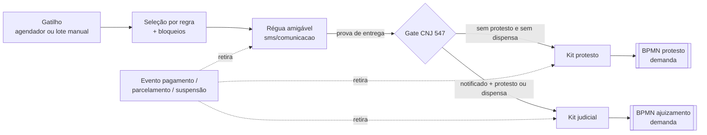

# PROJECT.md — cobranca (Java 25)

> Brief para agentes de IA: leia antes de planejar ou implementar qualquer coisa neste serviço.
> Base normativa e de mercado: [`docs/base_legal_divida_ativa.md`](docs/base_legal_divida_ativa.md).
> Regra do projeto (AGENTS.md): **não inferir — na dúvida, perguntar.**

## 1. Visão

O `cobranca` é o **cérebro da esteira de cobrança da dívida ativa antes do fluxo**. Ele decide
*quais* dívidas cobrar, *por qual via* e *quando*; conduz a cobrança amigável; garante as
condições prévias exigidas pelo CNJ; agrupa as dívidas em kits e **inicia o BPMN na `demanda`**.
Daí em diante, o ciclo é responsabilidade de outros serviços.

Por quê: desde o Tema 1184/STF e a Res. CNJ 547/2024, a execução fiscal exige **prévia solução
administrativa** (notificação) e **prévio protesto** (ou dispensa fundamentada). Sem essas
etapas, a execução corre risco de extinção por falta de interesse de agir. Hoje essa
responsabilidade está fragmentada em três serviços e nenhum deles aplica o gate.

## 2. O que este serviço substitui

| Serviço legado | Responsabilidade absorvida |
|---|---|
| `divida` | seleção e encaminhamento para **ajuizamento** |
| `cobranca` (Java 17, `br.com.attornatus`) | seleção e encaminhamento para **protesto** |
| `kitcobranca` | tentativa anterior de unificar os dois via `lib-action` — **descontinuado** |

Nos legados, só a parte de cobrança sai. O `divida` continua dono da dívida em si.

> O inventário ([`docs/inventario-paridade/`](docs/inventario-paridade/README.md)) mostrou que a divisão
> acima é simplificada: as três implementações **se sobrepõem**. O `divida` também tem via de protesto,
> o `cobranca` também tem via judicial e o `kitcobranca` cobre ambas. Quem roda depende do tenant
> (via `agendador` + flag).

## 3. Escopo

### Dentro

1. **Seleção de dívidas por regra**, parametrizada por tenant (`admin`, ADR comum 0010).
   Inclui os bloqueios de protestabilidade: CDA prescrita, CDA já ajuizada (salvo extinção
   sem mérito), exigibilidade suspensa e devedor sem CPF/CNPJ válido.
2. **Cobrança amigável (capacidade NOVA)**: régua configurável por perfil, tributo, faixa de
   valor e fase, com envio multicanal e fallback. O disparo é feito pelos adaptadores
   `sms`/`comunicacao`. Este serviço guarda a **prova de entrega** (DLR, entrega/bounce,
   carimbo de tempo, conteúdo enviado) como evidência da notificação prévia (Res. 547, art. 2º, §2º).
3. **Gate CNJ 547**: impede o encaminhamento judicial sem (i) notificação prévia comprovada e
   (ii) protesto efetivado **ou** dispensa fundamentada (ver §5).
4. **Kit de cobrança**: agrupamento das dívidas por devedor/via, que é a unidade enviada ao BPMN.
5. **Início do BPMN** na `demanda`, pela via judicial ou pela via de protesto.
6. **Interrupção da esteira**: um evento de pagamento, parcelamento ou suspensão retira a
   dívida da régua e dos kits pendentes. Se o parcelamento romper, ela volta à esteira.
7. **Disparo**: job agendado por tenant (via `agendador`, ADR java 0021, nunca `@Scheduled`)
   **e** lote manual iniciado pelo procurador.

### Fora (com o dono de cada item)

| Item | Dono |
|---|---|
| Carga de débitos, inscrição, situação da dívida, negativação recebida | `divida` |
| Cálculo e atualização | `calculo` |
| Parcelamento e transação | `parcelamento` |
| Débitos, guias | `debito` |
| Devedor, endereços, contatos | `pessoa` |
| Geração de petição inicial, CDA e dossiê probatório | etapas do BPMN (`demanda`) |
| Protocolo MNI/PJe/e-SAJ | `integrajud` |
| Ciclo do protesto com a CRA (remessa, confirmação, retorno, desistência, cancelamento, anuência) | BPMN (`demanda`) + adaptador |
| Intimações, prazos, art. 40 da LEF, Res. 689/2026, penhora | pós-BPMN (`processo`/`publicacao`/outros) |
| Portal do devedor / autoatendimento | fora do escopo |
| Integração direta com birôs | não existe; a negativação chega via `divida` |
| Pesquisa patrimonial, segmentação/rating | fora da **entrega inicial** |

## 4. Esteira

A fronteira do serviço é o início do BPMN. Os nós `[[ ]]` pertencem a outros serviços.

## 5. Regras de domínio

- **Gate CNJ 547 como requisito testável:** nenhum kit judicial é criado sem registro de
  notificação **entregue** e sem protesto efetivado ou dispensa registrada. O gate fica dentro
  do domínio e não pode ser contornado por configuração.
- **Dispensa do protesto (regra + procurador):**
  - hipóteses objetivas dispensam por regra: negativação (informada pelo `divida`), averbação
    em órgão de registro, indicação de bens à penhora;
  - "ineficiência administrativa" exige **justificativa de um procurador**, registrada e
    auditada (quem, quando, por quê).
- **Mensagens da régua** (LGPD e anti-golpe): base legal de obrigação legal/política pública
  (LGPD art. 7º, II/III, e art. 23), nunca consentimento. Conteúdo mínimo: órgão, número da
  CDA, valor, canal oficial. Nada de natureza da dívida ou dados de terceiros no SMS. Links
  **somente** para domínio oficial e **nunca** encurtados. Tom sem linguagem intimidatória
  (padrão do CDC art. 42 adotado como boa prática). O opt-out vale por canal e não encerra a cobrança.
- **Trilha de auditoria imutável** para seleção, dispensa, retirada da esteira e envio.

## 6. Restrições técnicas

- Java 25, Spring Boot 4.1.1, **Gradle**, pacote `ai.attus.cobranca`.
- **GraalVM native é desejável, não obrigatório.** Se uma lib da plataforma travar o build
  native, rodar em JVM é aceitável. Registre o motivo em vez de contornar com hacks de reflexão.
- Camadas Controller → Component → Service → Repository → Mapper, com nomenclatura PT-BR e
  testes BDD (ADRs em `docs/rules/`).
- **Domínio aqui, adaptador fora:** este serviço não fala diretamente com CRA, tribunais,
  gateways ou birôs. Toda conversa externa passa por serviços `integra*` ou adaptadores
  (`sms`, `comunicacao`, `integrajud`), preferencialmente via Kafka (ADR comum 0005).
- **`lib-action` somente como gatilho/borda de lote.** A esteira, os estados e as regras são
  modelados **explicitamente no domínio**. Se o desenho começar a se moldar à estrutura da lib,
  pare e questione.

## 7. Anti-objetivos (lições do `kitcobranca`)

- ❌ Abstração genérica do tipo "action" escondendo protesto, régua e ajuizamento. As etapas
  têm nome de domínio.
- ❌ Ficar preso à estrutura da `lib-action`: no `kitcobranca`, isso causou problemas de
  **performance**.
- ❌ Absorver responsabilidades que são do BPMN ou de outros serviços (documentos, protocolo,
  ciclo com a CRA).

## 8. Migração e critério de pronto

- **Big bang com drenagem:** na virada, os legados param de *iniciar* cobranças e só concluem
  o que já está em trânsito. Toda cobrança nova nasce aqui. Não há migração de estado em trânsito.
- **Pronto para a virada:** paridade funcional com o que `divida` (ajuizamento), `cobranca`
  (protesto) e `kitcobranca` fazem hoje **+ gate CNJ 547 ativo desde o dia 1**. Como o gate
  exige notificação prévia, a **régua amigável também é pré-requisito da virada**.

## 9. Decisões em aberto / riscos

| # | Tema | Situação |
|---|---|---|
| 1 | **Inventário de paridade** dos três legados | ✅ feito em 25/09/2026 — [`docs/inventario-paridade/`](docs/inventario-paridade/README.md). Abriu as decisões 1a–1e abaixo e as dúvidas D-B/D-R de lá |
| 1a | Os três legados **cadastram o processo** (EF/administrativo), **registram o protesto** e **gravam o `Ajuizamento`** na dívida *antes* do BPMN. Isso fica no `cobranca` ou vira etapa do BPMN? E quem grava o vínculo dívida↔processo? | pendente (D-B2, D-B3) |
| 1b | Qual caminho está ativo em cada tenant hoje (lote nativo × `kitcobranca`, flag `COBRANCA_VIA_PROCESSAMENTO_ACTION_HABILITADO`)? Isso define a paridade real | pendente (D-B1, D-B7) |
| 1c | Modelo de leitura: consultar o ES do `divida` (que hoje guarda estado de cobrança) ou manter projeção própria? | pendente (D-B4) |
| 1d | `LOTE_AJUIZAMENTO_EF` + arquivo de retorno à Fazenda entram no escopo? | pendente (D-B5) |
| 1e | Regras divergentes entre os legados (protesto `PAGO`, agrupamento, valor mínimo, bloqueio): escolher uma por tema | pendente (R1–R6) |
| 2 | Como o `cobranca` fica sabendo que o **protesto foi efetivado** (o ciclo corre no BPMN) para liberar o gate judicial: evento da `demanda`? consulta? | pendente |
| 3 | Contrato de retorno da **prova de entrega** vinda de `sms`/`comunicacao` (webhook → evento) | pendente |
| 4 | Critério e janela da **drenagem** (quando os legados param de iniciar; como evitar duplicidade na virada) | pendente |
| 5 | Res. CNJ 689/2026: especificações técnicas do CNJ previstas para até 90 dias após 14/07/2026 | monitorar; impacto indireto |
| 6 | CTN art. 174 alterado pela LC 208/2024 (protesto interrompe a prescrição) confirmado só indiretamente | validar redação vigente |

## 10. Glossário

- **CDA**: Certidão de Dívida Ativa, o título executivo.
- **Régua**: sequência parametrizada de notificações amigáveis.
- **Gate CNJ 547**: bloqueio do encaminhamento judicial sem notificação prévia e protesto/dispensa.
- **Kit de cobrança**: agrupamento de dívidas enviado a um BPMN (judicial ou protesto).
- **Dispensa**: justificativa para ajuizar sem protesto (por regra ou decisão de procurador).
- **Drenagem**: legado só conclui o que está em trânsito; nada novo nasce nele.
