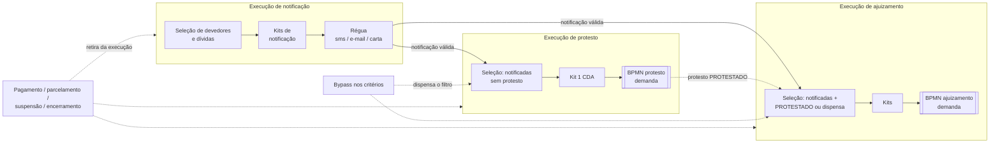

# PROJECT.md — cobranca-dividaativa (Java 25)

> Brief para agentes de IA: leia antes de planejar ou implementar qualquer coisa neste serviço.
> Base normativa e de mercado: [`docs/base_legal_divida_ativa.md`](docs/base_legal_divida_ativa.md).
> Como o serviço é construído (componentes, estados, contratos, decisões técnicas): [`ARCHITECTURE.md`](ARCHITECTURE.md).
> Regra do projeto (AGENTS.md): **não inferir — na dúvida, perguntar.**

## 1. Visão

O `cobranca-dividaativa` é o **cérebro da esteira de cobrança da dívida ativa antes do fluxo**.
Ele decide *quais* dívidas cobrar, *por qual via* e *quando*; conduz a cobrança amigável
(notificação); garante as condições prévias exigidas pelo CNJ; agrupa as dívidas em kits e
**inicia o BPMN na `demanda`**. Daí em diante, o ciclo é responsabilidade de outros serviços.

Por quê: desde o Tema 1184/STF e a Res. CNJ 547/2024, a execução fiscal exige **prévia solução
administrativa** (notificação) e **prévio protesto** (ou dispensa fundamentada). Sem essas
etapas, a execução corre risco de extinção por falta de interesse de agir. Hoje essa
responsabilidade está fragmentada em três serviços e nenhum deles aplica o gate.

> **Nome:** o serviço se chama `cobranca-dividaativa` (pacote `ai.attus.cobrancadividaativa`),
> decidido em 26/09/2026 para não colidir com o `cobranca` legado durante a drenagem. O repositório
> ainda se chama `att-cobranca` e o código ainda usa o nome antigo até a tarefa de renomeação do roadmap.

## 2. O que este serviço substitui

| Serviço legado | Responsabilidade absorvida | Em produção hoje |
|---|---|---|
| `divida` | seleção e encaminhamento para **ajuizamento** | ✅ caminho ativo do ajuizamento |
| `cobranca` (Java 17, `br.com.attornatus`) | seleção e encaminhamento para **protesto** | ✅ caminho ativo do protesto |
| `kitcobranca` | tentativa anterior de unificar os dois via `lib-action` — **descontinuado** | ❌ não ativo |

Nos legados, só a parte de cobrança sai. O `divida` continua dono da dívida em si.

> O inventário ([`docs/inventario-paridade/`](docs/inventario-paridade/README.md)) mostrou que as três
> implementações **se sobrepõem** no código. A **paridade real** (26/09/2026) é a do caminho ativo:
> regras do `divida` para ajuizamento e do `cobranca` legado para protesto. Do `kitcobranca` entram
> só as estratégias de empacotamento de kit e o descarte automático de dívida em falha no kit, por escolha explícita.

## 3. Escopo

### Dentro

1. **Seleção de dívidas por regra**, parametrizada por tenant (`admin`, ADR comum 0010).
   Inclui os bloqueios: CDA prescrita, CDA já ajuizada (salvo extinção sem mérito),
   exigibilidade suspensa, devedor sem CPF/CNPJ válido (**bloqueio fixo**), bloqueio de cobrança
   (cadastrado no `divida`) e protesto em `PAGO` ou `ENVIADO_PARA_CARTORIO`.
2. **Cobrança amigável — régua (capacidade NOVA)**: pipeline da fase de notificação, cadastrada
   pelo procurador na tela. Um tenant pode ter várias réguas; cada execução de notificação escolhe
   uma. A régua segue **automaticamente todos os passos/canais do ciclo** (28/09/2026); o primeiro aviso
   que conta como notificação já satisfaz a notificação prévia, e a dívida fica livre para protesto/ajuizamento
   enquanto a régua continua em paralelo. Pagamento, parcelamento ou situação que encerra interrompem. Ao fim do
   ciclo, as dívidas ainda abertas ficam disponíveis para um novo ciclo de notificação. O envio é feito pelos
   adaptadores: **WhatsApp — principal canal de cobrança** (28/09/2026; serviço ainda não existe, dependência
   externa), `sms` e e-mail/carta quando existirem. Este serviço guarda a prova (conteúdo
   enviado, carimbo de tempo, status do provedor) como evidência da notificação prévia (Res. 547,
   art. 2º, §2º), com o **nível de prova** obtido: **entregue** quando o canal confirma entrega;
   **envio aceito** quando o canal não oferece confirmação.
3. **Gate CNJ 547**: impede o encaminhamento judicial sem (i) notificação prévia válida e
   (ii) protesto em `PROTESTADO` **ou** dispensa (ver §5). Escapes: bypass e ajuizamento excepcional.
4. **Kit de cobrança**: agrupamento das dívidas, unidade enviada ao BPMN — e, na notificação, unidade notificada
   pela régua (o devedor é notificado por um grupo de débitos, 28/09/2026). Kit de protesto = 1 CDA.
   Inclui o **ajuizamento 4.0 / grande porte** (unidade judicial especial), com a regra do `divida` (inventário C10, `RegraAjuizamentoQuatroPontoZero`), ligada por tenant em `INSTITUICAO_PERMITE_AJUIZAMENTO_UNIDADE_JUDICIAL_ESPECIAL`.
5. **Cadastro antes do BPMN e início do BPMN** na `demanda`: processo (EF/administrativo),
   protesto, gravação do `Ajuizamento` na dívida e início do fluxo, pela via judicial ou de protesto.
6. **Interrupção**: pagamento, parcelamento, suspensão ou encerramento retiram a dívida da execução
   em andamento. Situações parciais mantêm a dívida pelo saldo.
7. **Disparo por fase**: cada execução faz **uma** fase — notificação, protesto **ou** ajuizamento —
   por job agendado (via `agendador`, ADR java 0021, nunca `@Scheduled`) ou lote manual.
   Execução com lista explícita de devedores ou dívidas é **prioritária** (fila separada).
8. **Ajuizamento excepcional**: 1 dívida, qualquer situação, desde que não esteja ajuizada.
9. **Reprocessamento** (paridade P20), em dois níveis: **devedor** com erro volta à qualificação de devedor;
   **kit inválido** volta à qualificação de dívida com as mesmas dívidas, sempre revalidadas. Dívida sozinha
   não é reprocessável. O procurador também pode **desmontar** o kit inválido. Status dos itens: `SUCESSO`,
   `ERRO` (algo deu errado, mas pode ser corrigido), `AVISO` (não há o que fazer, é só um aviso) e `DESCARTADO`.

### Fora (com o dono de cada item)

| Item | Dono |
|---|---|
| Carga de débitos, inscrição, situação da dívida, negativação recebida | `divida` |
| CRUD de bloqueio de cobrança | `divida` (este serviço só consulta) |
| Cálculo e atualização | `calculo` |
| Parcelamento e transação | `parcelamento` |
| Débitos, guias | `debito` |
| Devedor, endereços, contatos | `pessoa` |
| Geração de petição inicial, CDA e dossiê probatório | etapas do BPMN (`demanda`) |
| Protocolo MNI/PJe/e-SAJ | `integrajud` |
| Ciclo do protesto com a CRA (remessa, confirmação, retorno, desistência, cancelamento, anuência) | BPMN (`demanda`) + adaptador |
| Intimações, prazos, art. 40 da LEF, Res. 689/2026, penhora | pós-BPMN (`processo`/`publicacao`/outros) |
| Portal do devedor / autoatendimento | fora do escopo |
| Integração direta com birôs | não existe; a negativação chega via `divida` |
| `LOTE_AJUIZAMENTO_EF` + arquivo de retorno à Fazenda | **descontinuado** (não entra neste serviço) |
| Pesquisa patrimonial, segmentação/rating | fora da **entrega inicial** |
| Modo simulação, dispensa por averbação/bens à penhora | **2ª entrega** |
| Modo encadeado (uma execução atravessa várias fases) | evolução após a virada |

## 4. Esteira

A esteira é percorrida **por fases independentes**: cada execução faz uma fase. O estado da dívida
entre as fases (notificada, protestada, dispensada) fica indexado no `divida`, e a seleção da fase
seguinte só traz quem cumpre as condições (salvo bypass).

A fronteira do serviço é o início do BPMN. Os nós `[[ ]]` pertencem a outros serviços.

## 5. Regras de domínio

- **Gate CNJ 547 como requisito testável:** nenhum kit judicial é criado sem notificação válida e
  sem protesto `PROTESTADO` ou dispensa registrada, exceto pelos dois escapes abaixo. O gate fica
  no domínio e não pode ser desligado por parâmetro.
- **Notificação não expira** (28/09/2026): uma vez obtido um aviso válido (entregue/DLR, ou envio aceito no canal
  sem confirmação), ele vale **para sempre** como ação comprobatória. Não há parâmetro de validade.
- **Escape 1 — bypass por execução (decidido em 26/09/2026):** flags nos critérios da execução
  (manual ou agendada) pulam a notificação, o protesto ou ambos. **Não exige justificativa** —
  algumas PGEs/PGMs não seguem a Res. 547. Exige **privilégio próprio**, checado ao salvar o job
  (`agendador`/`frontng`) e no request da execução manual. Cada execução guarda snapshot imutável
  (com hash) dos critérios e do bypass, com autor e data. Esses ajuizamentos ficam expostos à
  extinção por falta de interesse de agir (Tema 1184).
- **Escape 2 — ajuizamento excepcional:** 1 dívida, ignora gate, situação e validadores; única
  barreira é já estar ajuizada. Registrado com autor e data como o bypass.
- **Dispensa do protesto:**
  - por regra: negativação (informada pelo `divida`, já no índice); registrada pelo gate no ajuizamento (28/09/2026);
  - por procurador: "ineficiência administrativa", com **justificativa**, registrada e auditada
    (quem, quando, por quê);
  - averbação em órgão de registro e indicação de bens à penhora: **2ª entrega** (sem fonte de dado hoje).
- **Mensagens da régua** (LGPD e anti-golpe): base legal de obrigação legal/política pública
  (LGPD art. 7º, II/III, e art. 23), nunca consentimento. Conteúdo mínimo: órgão, número da
  CDA, valor, canal oficial. Direção provável (28/09/2026): **conteúdo específico por canal**, por causa das políticas
  próprias de cada um (ex.: templates aprovados do WhatsApp, tamanho do SMS); como o mínimo se aplica ao aviso de kit
  com várias CDAs segue em aberto (§9 item 17). Nada de natureza da dívida ou dados de terceiros no SMS. Links
  **somente** para domínio oficial e **nunca** encurtados. Tom sem linguagem intimidatória
  (padrão do CDC art. 42 adotado como boa prática). O opt-out vale por canal e não encerra a cobrança; direção inicial do produto (28/09/2026): opt-out **só no
  WhatsApp**, guardado no **índice de devedor do `divida`**.
- **Trilha de auditoria imutável** para seleção, dispensa, bypass, excepcional, retirada e envio.
  Sem expurgo na 1ª entrega.

## 6. Restrições técnicas

- Java 25, Spring Boot 4.1.1, **Gradle**, pacote `ai.attus.cobrancadividaativa`.
- Banco **Oracle e PostgreSQL** (migrations portáveis, ADR java 0006).
- **GraalVM native é desejável, não obrigatório.** Se uma lib da plataforma travar o build
  native, rodar em JVM é aceitável. Registre o motivo em vez de contornar com hacks de reflexão.
- Camadas Controller → Component → Service → Repository → Mapper, com nomenclatura PT-BR e
  testes BDD (ADRs em `docs/rules/`).
- **Domínio aqui, adaptador fora:** este serviço não fala diretamente com CRA, tribunais,
  gateways ou birôs. Toda conversa externa passa por serviços `integra*` ou adaptadores
  (`sms`, `integrajud`…). **Fatos via Kafka** (ADR comum 0005); **REST síncrono onde o contrato
  só existe assim** — cadastro de processo/protesto, gravação do `Ajuizamento`, início do BPMN e
  seleção/atualização no `divida` (decidido em 26/09/2026).
- **Canais de notificação não bloqueiam este serviço** (28/09/2026): kits e régua seguem sem a existência de qualquer
  canal; a falha acontece na chamada ao serviço de integração (ou ao BPMN) e é tratada como erro dessa chamada.
- **Transição entre etapas da execução via Kafka**, com **um tópico por etapa** (28/09/2026) e mensagem **por bloco** (seleção,
  validação, agrupamento, passo da régua) e **por kit** (gerar cobrança) — nunca por dívida.
- **`lib-action` somente como gatilho/borda de lote.** A esteira, os estados e as regras são
  modelados **explicitamente no domínio**. Se o desenho começar a se moldar à estrutura da lib,
  pare e questione.

## 7. Anti-objetivos (lições do `kitcobranca`)

- ❌ Abstração genérica do tipo "action" escondendo protesto, régua e ajuizamento. As etapas
  têm nome de domínio.
- ❌ Ficar preso à estrutura da `lib-action`: no `kitcobranca`, isso causou problemas de
  **performance** (1 mensagem Kafka por etapa por item).
- ❌ Absorver responsabilidades que são do BPMN ou de outros serviços (documentos, protocolo,
  ciclo com a CRA).
- ❌ Portar parâmetro ou critério que hoje não tem efeito. Critério novo entra sob demanda, desenhado.

## 8. Migração e critério de pronto

- **Drenagem por tenant:** um parâmetro por tenant faz o `agendador` enviar os jobs ao novo
  serviço. Com ele ligado, os legados param de *iniciar* cobranças naquele tenant e só concluem o
  que já está em trânsito. Não há migração de estado em trânsito. Ordem de liberação do workspace
  (PGESP por último).
- **Pronto para a virada:** paridade funcional com o caminho ativo — `divida` (ajuizamento) e
  `cobranca` legado (protesto) — **+ gate CNJ 547 ativo desde o dia 1** + **régua operando**
  **pelo WhatsApp**, principal canal de cobrança — pré-requisito da virada (28/09/2026). Hoje não existe serviço
  que implemente essa integração (dependência externa E-13). A confirmação de entrega segue desejável, não bloqueante.

## 9. Decisões e riscos

Decisões fechadas em 25–27/09/2026 (detalhe e alternativas no `ARCHITECTURE.md` §1.3):

| Tema | Decisão |
|---|---|
| Inventário de paridade | ✅ feito em 25/09/2026 — [`docs/inventario-paridade/`](docs/inventario-paridade/README.md) |
| Caminho ativo (D-B1/D-B7) | ✅ ajuizamento pelo `divida`, protesto pelo `cobranca` legado, `kitcobranca` inativo |
| Cadastro antes do BPMN (D-B2/D-B3) | ✅ neste serviço, antes de iniciar o BPMN |
| Modelo de leitura (D-B4) | ✅ via API do `divida`, que consulta o próprio índice; o índice passa a guardar notificação, dispensa e categoria do protesto |
| `LOTE_AJUIZAMENTO_EF` (D-B5) | ✅ descontinuado |
| Excepcional (D-B6) | ✅ ignora gate e situação; só barra dívida já ajuizada |
| Bloqueio de cobrança (D-B8) | ✅ CRUD fica no `divida` |
| Execução | ✅ por fase; encadeado como evolução; prioritária quando há lista explícita |
| Bypass | ✅ flags nos critérios, sem justificativa, privilégio checado ao salvar o job |
| Protesto efetivado | ✅ categoria `PROTESTADO` |
| Prova da notificação | ✅ nível por canal (entregue × envio aceito); DLR desejável, não bloqueante |
| Regras divergentes R1–R6 | ✅ ver `ARCHITECTURE.md` §6 |
| Drenagem | ✅ por tenant |
| Retenção | ✅ sem expurgo na 1ª entrega; política final com o jurídico |
| Nome | ✅ `cobranca-dividaativa` |
| Ajuizamento 4.0 / grande porte | ✅ entra na **1ª entrega** (27/09/2026), paridade com o `divida` |
| Kit com dívida em falha | ✅ Kit com dívida em falha segue `DESCARTAR_AUTOMATICAMENTE_DIVIDAS_INVALIDAS_DO_KIT_HABILITADO` (regra do `kitcobranca`, escolha explícita de 27/09/2026): ligado ⇒ a dívida em falha é descartada com motivo e o kit segue com as demais; desligado ⇒ o kit inteiro é invalidado. Não vale para dívida já ajuizada detectada na geração, que é descarte por regra (Q-11). `DEVE_GERAR_COBRANCA_QUANDO_DIVIDA_NO_LOTE_COM_ERRO` do `divida` **não é portado** |
| Status dos itens | ✅ etapa + status `SUCESSO`/`ERRO`/`AVISO`/`DESCARTADO` (27/09/2026). **`ERRO`** = algo deu errado, mas pode ser corrigido; **`AVISO`** = não há o que fazer, é só um aviso. `ERRO` e `AVISO` chegam ao agrupamento, onde o descarte automático decide |
| Reprocessamento | ✅ (27/09/2026) devedor com `ERRO` → qualificação de devedor (refaz a consulta); kit `INVALIDO` → qualificação de dívida com as mesmas dívidas, menos as removidas pelo procurador, sempre revalidadas; kit antigo `REPROCESSADO` e nasce kit novo. Reabre a execução original. Kit inválido pode ser desmontado. Mesmo privilégio de iniciar a execução |
| Falha na saga | ✅ (27/09/2026) retry automático até o parâmetro geral de tentativas; esgotado, compensa (`DELETE /processos/{id}` → o `divida`/`protesto` removem o vínculo por evento) e o kit fica descartado com a justificativa, sem ação; compensação que falha fica pendente, notificada, e só a compensação pode ser reprocessada |
| Tópicos do legado sem consumidor Java | ✅ (28/09/2026) sem prejuízo na virada: `cobranca.notificar.endereco.devedor.invalido.0`, `cobranca.cmd.registrar-erro-dividas-nao-selecionadas.0` e `cobranca.concluiu.*` **não ganham substituto**; o comportamento que eventualmente sustentavam é atendido pelo desenho próprio deste serviço (demanda de endereço inválido na F-016, status/motivo dos itens, fatos `cobranca-dividaativa.*`) |
| Régua na execução de notificação | ✅ (28/09/2026) régua **automática**: as dívidas selecionadas na execução de notificação entram na esteira da régua escolhida e seguem os passos (canal, intervalo, fallback) sem escolha de canal pelo procurador por execução; a esteira é interrompida nas mesmas situações da interrupção (F-013 RF-02: `LIQUIDADA`, `CANCELADA`, `ANISTIADO`, `PREESCRITO`, `PARCELADA`, `SUSPENSA`; parciais continuam pelo saldo), confirmado em 28/09/2026 — via F-013 e reconsulta antes de cada passo na F-008 |
| Notificação por kit | ✅ (28/09/2026) a notificação tem etapa de **agrupamento**: o devedor é notificado por um grupo de débitos. O grupo é um kit (via `NOTIFICACAO`), com a mesma chave do ajuizamento, a mesma regra de dívida em falha (`DESCARTAR_AUTOMATICAMENTE_DIVIDAS_INVALIDAS_DO_KIT_HABILITADO`) e o mesmo reprocessamento/desmontar. Dívida retirada no meio da régua sai e o kit segue com as demais. **Sem limites de kit** na notificação; estratégia de empacotamento não se aplica (Q-15). Estados: `MONTADO` → `EM_REGUA` → `REGUA_CONCLUIDA` \| `DESCARTADO`, mais `INVALIDO`/`REPROCESSADO` (Q-16) |
| Opt-out | ✅ parcial (28/09/2026): **WhatsApp é o principal canal de cobrança** e o único com opt-out; o dado fica no **índice de devedor do `divida`** (não no `pessoa` nem neste serviço). SMS e e-mail/carta não têm opt-out. Não há serviço de WhatsApp hoje: dependência externa (E-13). A captação e a gravação no índice são externas (E-12/E-13); Q-01 fechada |
| Reprocessar devedor com kit (Q-14) | ✅ (28/09/2026) Devedor só é reprocessável **se ainda não gerou kit** na execução: ter kit significa que passou pela qualificação de devedor com sucesso, e o caminho é reprocessar o kit. O pedido para devedor com kit é **recusado com exceção** ("o devedor não pode ser reprocessado porque já existem kits gerados para ele"); nenhum kit é desfeito |
| Dívida já ajuizada na geração (Q-11) | ✅ (28/09/2026) checagem prévia das dívidas já em processo **judicial** antes de cadastrar o processo EF (depende de filtro de tipo no `processo`, E-14). Dívida encontrada é **descarte por regra**, independente do parâmetro de descarte automático: sai `DESCARTADO` ("dívida já ajuizada") e o kit segue com as demais. Na execução com **lista explícita** de dívidas, a dívida informada e descartada fica **visível no kit** ("1 de 3 dívidas informadas descartada: já ajuizada no processo P1") e no sumário, para o procurador entender por que o kit tem menos dívidas. A trigger de unicidade do `processo` barra a corrida residual; o processo nunca é criado com a dívida. A recusa no `divida` (E-11) passa a ser proteção em profundidade |
| Devedores e dívidas informados | ✅ (28/09/2026) se o procurador **informa** devedores ou dívidas (lista explícita), **todo devedor ou dívida informado que não é selecionado fica à mostra com o motivo** — descartado no fluxo ou filtrado pela consulta — para ele ver que algo esperado não entrou. Sem lista (só critérios) não há conciliação: não existe expectativa a confirmar |
| Reconfirmação no protesto (Q-07) | ↩ revertida em 28/09/2026: sem validade, a notificação não muda depois de feita; o protesto usa só o filtro da consulta |
| Validade da notificação | ✅ (28/09/2026) removida: a notificação com aviso válido (nível de prova do canal) **vale para sempre** como prova — não há validade (28/09/2026); `VALIDADE_NOTIFICACAO_PREVIA_DIAS` sai do catálogo |
| Hardcodes por tenant (Q-02) | ✅ (28/09/2026) PGMCABO unidade 179: só no arquivo de retorno do `LOTE_AJUIZAMENTO_EF` (descontinuado) ⇒ `NOT_REQUIRED`; PGEPA espera 2 s (`Thread.sleep` no consumer de atualização da CDA, `cobranca` `CobrancaConsumer.java:54-56`) ⇒ **não portado** — tamanho de bloco e concorrência por parâmetro cobrem o freio; participações 143/168 (processo ADMINISTRATIVO do protesto, `GeradorCobrancaProtesto.java:88,94`, fixas para todos os tenants) ⇒ **parâmetros** `ID_TIPO_PARTICIPACAO_CONTRARIA_PROCESSO_ADM` e `ID_TIPO_PARTICIPACAO_REPRESENTADA_PROCESSO_ADM` (precedente no `kitcobranca`, catálogo E-10) |
| CSV de origem (Q-08) | ✅ (28/09/2026) CSV com cabeçalho; **cada coluna é um critério de lista** que existe hoje: `numero_cda` (→ `numeroDividas`), `processo_inscricao` (→ `dividasProcessoInscricao`), `documento_devedor` (→ `documentoDevedores`); colunas opcionais, listas independentes; as colunas preenchidas se combinam por **E** entre si e com os critérios do job (como no `divida`). A paridade completa dos campos com os critérios de lista do legado fica como tarefa pendente (T-139) |
| Endereço inválido (Q-09) | ✅ (28/09/2026) devedor com endereço inválido e `DEVE_GERAR_DEMANDA_CONFERENCIA_ENDERECO_DEVEDOR_INVALIDO` ligado fica `ERRO` ("endereço inválido — aguardando conferência") na qualificação de devedor e **não segue** para as dívidas (não gera kit); o serviço publica o fato para a `demanda` abrir `CONFERENCIA_ENDERECO_DEVEDOR`; ao concluir a demanda, o BPMN chama este serviço para **reprocessar o devedor** na execução original (paridade com o legado, que chama o `divida`). Exige mudança na `demanda` (E-17) |
| Falha na atualização do devedor | ✅ (28/09/2026) Falha na atualização do devedor (ex.: `pessoa` fora do ar) **para a esteira do devedor** (28/09/2026): o devedor fica `ERRO` na etapa `QUALIFICACAO_DEVEDOR` (motivo "falha na atualização do devedor"), suas dívidas **não são consultadas** e nenhum kit é gerado. O erro é do devedor, não do kit: o reprocessamento do devedor recomeça do mesmo ponto, sem desfazer kits. Substitui a regra de 27/09 (dívidas em `ERRO` até o agrupamento), que deixava o devedor preso num kit inválido sem refazer a atualização |
| Um ciclo de régua por vez | ✅ (28/09/2026) a execução de notificação descarta, por regra ("já em régua"), a dívida que já está em kit de notificação `EM_REGUA` — a dívida notificada fica sem reserva, e sem essa regra entraria num 2º ciclo simultâneo |
| Dispensa por negativação | ✅ (28/09/2026) a negativação já está no índice do `divida` (`negativada`/`dataNegativacao`): a consulta de ajuizamento aceita `PROTESTADO` **ou** dispensa **ou** negativada, e o **gate** reconfirma e grava a dispensa `NEGATIVACAO`/`REGRA` com a data da negativação. Sem consumer novo; o fato `dispensou.protestos.0` fica só para a dispensa do procurador (28/09/2026) |
| Reconfirmação do protesto no gate | ✅ (28/09/2026) a categoria vem do `protesto` por `GET /protestos/ativo?dividaId=` (existente; `situacaoAtual.tipoSituacao.categoria`), uma chamada por dívida do kit judicial, sem depender do índice; lote só se a medição (F-019) indicar |
| Validação do kit judicial | ✅ (28/09/2026) mesmas regras e parâmetros do `divida` (mesmo processo de inscrição, assunto, data de atualização, prescrição); kit reprovado fica `INVALIDO` com o motivo da regra, reprocessável ou desmontável |
| Régua alterada ou inativada (Q-18) | ✅ (28/09/2026) **inativar** a régua encerra os kits `EM_REGUA` que a usam (kit `DESCARTADO`, motivo "régua inativada"; itens `DESCARTADO`, reservas liberadas), e as dívidas ficam livres para um novo ciclo; **alterar** (texto, intervalo antecipado para data ainda futura) vale para os passos **ainda não executados** dos kits em curso, que seguem na mesma régua — passos já executados não são refeitos; a alteração que levaria um passo ainda não executado de algum kit `EM_REGUA` a uma data **já passada** é **recusada** ao salvar; passo **removido** deixa de ser executado nos kits em curso |
| Dívida retirada com kit adiantado (Q-19) | ✅ (28/09/2026) dívida retirada quando o kit de protesto/ajuizamento está `MONTADO`, **em saga** (`PROCESSO_CADASTRADO`/`VINCULADO`) ou `INVALIDO`: o kit é **desmontado** e as **demais dívidas são descartadas** com motivo ("kit desmontado: dívida X retirada por <situação>"); no kit em saga, desmontar = **compensar** (`DELETE /processos/{id}`, mesma compensação da saga, §7); kit com BPMN iniciado não é afetado |
| Ciclo da régua | ✅ (28/09/2026) a régua **não para no primeiro aviso válido**: segue todos os passos/canais do ciclo. Cada aviso válido publica `notificou.dividas.0` (o índice guarda a referência da notificação). No primeiro aviso válido a reserva é liberada e a dívida pode ir a protesto/ajuizamento com a régua em paralelo. Ao fim do ciclo, dívidas abertas ficam disponíveis para novo ciclo |
| Atualização do devedor (Receita Federal) | ✅ **não é parâmetro**: vem nas flags `higienizar`/`enriquecer` dos critérios (27/09/2026), como no `divida`/`cobranca` legado |

Em aberto:

| # | Tema | Dono |
|---|---|---|
| 5 | Res. CNJ 689/2026: especificações técnicas do CNJ previstas para até 90 dias após 14/07/2026 | monitorar; impacto indireto |
| 6 | CTN art. 174 alterado pela LC 208/2024 (protesto interrompe a prescrição) confirmado só indiretamente | validar redação vigente |

## 10. Glossário

- **CDA**: Certidão de Dívida Ativa, o título executivo.
- **Execução**: um disparo (job ou lote manual) de **uma fase** — notificação, protesto ou ajuizamento.
- **Régua**: pipeline da fase de **notificação** — sequência de avisos amigáveis (canal, intervalo,
  fallback), cadastrada pelo procurador. Não inclui protesto nem ajuizamento.
- **Gate CNJ 547**: bloqueio do encaminhamento judicial sem notificação prévia e protesto/dispensa.
- **Bypass**: flags nos critérios da execução que pulam notificação e/ou protesto.
- **Kit de cobrança**: agrupamento de dívidas enviado a um BPMN (judicial ou protesto) ou notificado pela régua (notificação).
- **Dispensa**: hipótese que substitui o protesto (por regra ou decisão de procurador).
- **Drenagem**: legado só conclui o que está em trânsito; nada novo nasce nele.
