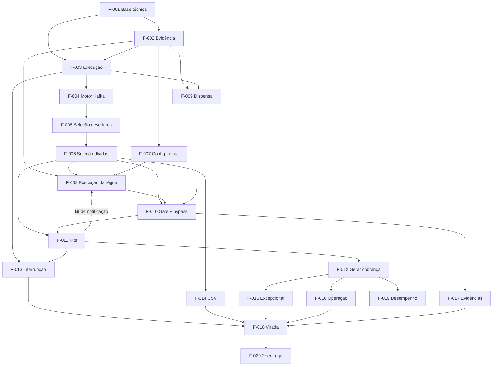

# ROADMAP.md — cobranca-dividaativa (Java 25)

## Projeto

O `cobranca-dividaativa` concentra a cobrança da dívida ativa **antes do BPMN**. Cada execução faz
uma fase — notificação (régua), protesto ou ajuizamento — sobre as dívidas aptas; protesto e
ajuizamento passam pelo gate CNJ 547 (salvo bypass/excepcional), montam kits, cadastram
processo/protesto, gravam o vínculo na dívida e iniciam o BPMN na `demanda`. Substitui o caminho
ativo de cobrança do `divida` (ajuizamento) e do `cobranca` legado (protesto).

**Fontes** (em ordem de prioridade): [`PROJECT.md`](PROJECT.md) → [`ARCHITECTURE.md`](ARCHITECTURE.md)
→ [`features/`](features/) → [`docs/inventario-paridade/`](docs/inventario-paridade/README.md) →
[`docs/base_legal_divida_ativa.md`](docs/base_legal_divida_ativa.md) → código. Atualizado em 28/09/2026.

## Como este roadmap funciona

Este arquivo é o **índice**. O detalhe de cada feature mora em `features/<F-xxx>/`:

| Arquivo | Conteúdo | Existe para |
|---|---|---|
| `spec.md` | **O quê**: requisitos (RF/RNF), regras (RN), critérios de aceite Dado/Quando/Então, fora de escopo, pendências | todas as features |
| `design.md` | **Como**: componentes por camada, contratos, decisões locais, riscos | F-001…F-006 |
| `tasks.md` | **Tarefas e status** (fonte única), com arquivos, testes e verificação | F-001…F-006 |

Features F-007 em diante ainda têm **tarefas preliminares** listadas aqui; elas migram para o
`tasks.md` da feature quando o `design.md` for escrito (depois que as dependências externas da fase
tiverem contrato definido). Os IDs de tarefa (T-xxx) são mantidos na migração.

## Estado atual

| Item | Estado |
|---|---|
| Contexto (`PROJECT.md`, `ARCHITECTURE.md`, inventário, base legal) | DONE — decisões A1–A22 |
| Specs das 20 features | DONE |
| Design e tarefas F-001…F-006 | DONE |
| Esqueleto Spring Boot (`CobrancaApplication`, `contextLoads`) | DONE — nome/pacote antigos até T-002 |
| Código de domínio | PENDING — nada implementado |
| Dependências externas E-01…E-10 | nenhuma iniciada |

**Próximo passo:** F-001 (começa por T-002 renomear e T-003 abrir as dependências externas).

## Regras de execução

- Seguir as fases na ordem; features sem dependência entre si podem correr em paralelo.
- Antes de implementar: ler `spec.md` → `design.md` → `tasks.md` da feature e conferir as dependências.
- Status é atualizado **só no `tasks.md`**; ao concluir a feature, atualizar também o status na tabela de fases abaixo.
- Tarefa `BLOCKED` não é implementada com suposição. Resolver o bloqueio (`Q-xx`/`E-xx`) e registrar no `PROJECT.md` §9 / `ARCHITECTURE.md` §14.
- Enquanto uma dependência externa não existir, o lado deste serviço pode ser implementado contra **stub WireMock** do contrato proposto no `design.md` (ADR java 0010); a integração real fica `BLOCKED`.
- **Canais de notificação não bloqueiam a implementação** (28/09/2026): o que é deste serviço (kits, régua, evidência, opt-out lido do índice) segue sem a existência de qualquer canal, implementado contra a interface de canal e o contrato proposto. Canal ausente ou fora do ar é **erro na chamada** ao serviço de integração, tratado como envio falho do passo — nunca `BLOCKED` aqui. Vale para E-07, E-08, E-12 e E-13.
- Não alterar decisão documentada sem atualizar `ARCHITECTURE.md` e a `spec.md` afetada. Não implementar requisito fora da spec (`AGENTS.md`: **não inferir, perguntar**).
- Testes BDD junto com cada tarefa (`@Nested Dado_*` / `@Test Entao_*`, ADR java 0008); cada CA da spec tem teste correspondente.
- Ao concluir uma feature: registrar a regra de negócio no `PLAYBOOK.md` (`AGENTS.md`).
- Antes de pedir review: build + suíte completa (ADR agente 0005) e `gate-pipeline.sh`.

**Legenda:** `DONE` · `IN_PROGRESS` · `PENDING` · `BLOCKED` · `NOT_REQUIRED`.

---

## Fases e features

| Fase | Feature | Status | Depende de | Documentos |
|---|---|---|---|---|
| 0 — Fundação | [F-001 Base técnica e renomeação](features/F-001-base-tecnica/) | PENDING | — | spec · design · tasks |
| 0 — Fundação | [F-002 Evidência e trilha de auditoria](features/F-002-evidencia-auditoria/) | PENDING | F-001 | spec · design · tasks |
| 1 — Execução | [F-003 Execução, itens e reserva](features/F-003-execucao/) | PENDING | F-001, F-002 | spec · design · tasks |
| 1 — Execução | [F-004 Motor de etapas via Kafka](features/F-004-motor-etapas/) | PENDING | F-003 | spec · design · tasks |
| 2 — Seleção | [F-005 Seleção de devedores](features/F-005-selecao-devedores/) | PENDING | F-004 | spec · design · tasks |
| 2 — Seleção | [F-006 Seleção de dívidas](features/F-006-selecao-dividas/) | PENDING | F-005 | spec · design · tasks |
| 3 — Régua | [F-007 Configuração da régua](features/F-007-configuracao-regua/) | PENDING | F-002 | spec |
| 3 — Régua | [F-008 Execução da régua e evidência](features/F-008-execucao-regua/) | PENDING | F-002, F-006, F-007, F-011 (kit de notificação) | spec |
| 4 — Gate | [F-009 Dispensa do protesto](features/F-009-dispensa-protesto/) | PENDING | F-002, F-003 | spec |
| 4 — Gate | [F-010 Gate e bypass](features/F-010-gate-bypass/) | PENDING | F-006, F-008, F-009 | spec |
| 5 — Kits e cobrança | [F-011 Agrupamento e empacotamento](features/F-011-agrupamento-kits/) | PENDING | F-006 (notificação, protesto), F-010 (ajuizamento) | spec |
| 5 — Kits e cobrança | [F-012 Gerar cobrança (SAGA)](features/F-012-gerar-cobranca/) | PENDING | F-011 | spec |
| 5 — Kits e cobrança | [F-013 Interrupção](features/F-013-interrupcao/) | PENDING | F-003, F-011 | spec |
| 6 — Origens e operação | [F-014 Origem por arquivo CSV](features/F-014-origem-csv/) | PENDING | F-006 | spec |
| 6 — Origens e operação | [F-015 Ajuizamento excepcional](features/F-015-ajuizamento-excepcional/) | PENDING | F-012 | spec |
| 6 — Origens e operação | [F-016 Operação de execuções e kits](features/F-016-operacao/) | PENDING | F-012 | spec |
| 7 — Evidência e virada | [F-017 Evidências para a inicial](features/F-017-evidencias-inicial/) | PENDING | F-010 | spec |
| 7 — Evidência e virada | [F-018 Preparação da virada](features/F-018-virada/) | BLOCKED | F-001…F-017; E-01, E-02, E-05, E-07, E-09, E-10, E-12, E-13, E-14 | spec |
| 7 — Evidência e virada | [F-019 Medição de desempenho](features/F-019-desempenho/) | PENDING | F-012 | spec |
| Pós-virada | [F-020 Itens da 2ª entrega](features/F-020-segunda-entrega/) | PENDING | F-018 | spec |

## Grafo de dependências

F-007 e F-009 podem começar logo após a Fase 0, em paralelo com a seleção. A via de **protesto**
(F-006 → F-011 → F-012) não depende do gate de ajuizamento (F-010). O kit de **notificação** (F-011 T-210)
só depende da F-006 e precede a F-008; a dependência F-010 → F-011 vale só para o kit judicial.

---

## Em aberto

Nenhuma questão `Q-xx` em aberto (28/09/2026). Pendências fora deste serviço estão em **Dependências externas** (E-15 retenção, E-16 templates, E-17 `demanda`, entre outras).

## Decididas

Registro das questões `Q-xx` já decididas, para rastrear as citações nas specs. O detalhe mora na fonte indicada.

| ID | Decisão | Onde |
|---|---|---|
| Q-01 | Opt-out só no WhatsApp; este serviço só **lê** o dado do índice de devedor do `divida`; captação externa (E-12/E-13) | `PROJECT.md` §9 · `ARCHITECTURE.md` §6.2, §14 item 11 |
| Q-02 | Hardcodes: 179 e espera da PGEPA não portados; 143/168 viram parâmetros do processo ADMINISTRATIVO | `PROJECT.md` §9 · `ARCHITECTURE.md` §5.3 |
| Q-03 | Ajuizamento 4.0 / grande porte entra na 1ª entrega (27/09/2026) | `ARCHITECTURE.md` A19 |
| Q-04 | Tópicos do legado sem consumidor Java não ganham substituto | `PROJECT.md` §9 · `ARCHITECTURE.md` §14 item 14 |
| Q-05 | Atualização do devedor pelas flags `higienizar`/`enriquecer` dos critérios, não por parâmetro (27/09/2026) | `ARCHITECTURE.md` A9 |
| Q-06 | Retenção da evidência vira pendência externa (E-15); sem expurgo na 1ª entrega | `ARCHITECTURE.md` §14 item 16 |
| Q-07 | Revertida: o protesto **não** reconfirma a notificação (a notificação não expira) | `ARCHITECTURE.md` §8.1, §14 item 18 |
| Q-08 | CSV: uma coluna por critério de lista (`numero_cda`, `processo_inscricao`, `documento_devedor`), combinadas por E | `PROJECT.md` §9 · `ARCHITECTURE.md` §4 |
| Q-09 | Endereço inválido com demanda: devedor `ERRO` sem seguir para as dívidas; reprocessado ao concluir a demanda (E-17) | `PROJECT.md` §9 · `ARCHITECTURE.md` §14 item 20 |
| Q-10 | Simulação e modo encadeado adiados para a 2ª entrega (F-020) | `ARCHITECTURE.md` §14 item 21 |
| Q-11 | Dívida já ajuizada na geração: checagem prévia (E-14) + trigger do `processo`; descarte por regra | `PROJECT.md` §9 · `ARCHITECTURE.md` §7 |
| Q-12 | Régua automática, interrompida pelas situações da F-013 | `ARCHITECTURE.md` §6.2, §14 item 24 |
| Q-13 | A notificação tem kit (via `NOTIFICACAO`) | `ARCHITECTURE.md` A23 |
| Q-14 | Devedor que já gerou kit não é reprocessável (exceção); reprocessa-se o kit | `ARCHITECTURE.md` §7.1 |
| Q-15 | Kit de notificação sem limites nem estratégia de empacotamento | `ARCHITECTURE.md` A23 |
| Q-16 | Estados do kit de notificação: `MONTADO` → `EM_REGUA` → `REGUA_CONCLUIDA` \| `DESCARTADO` (+ `INVALIDO`/`REPROCESSADO`) | `ARCHITECTURE.md` §6.2 |
| Q-18 | **inativar** a régua encerra os kits `EM_REGUA` que a usam (kit `DESCARTADO`, motivo "régua inativada"; itens `DESCARTADO`, reservas liberadas), e as dívidas ficam livres para um novo ciclo; **alterar** (texto, intervalo antecipado para data ainda futura) vale para os passos **ainda não executados** dos kits em curso, que seguem na mesma régua — passos já executados não são refeitos; a alteração que levaria um passo ainda não executado de algum kit `EM_REGUA` a uma data **já passada** é **recusada** ao salvar; passo **removido** deixa de ser executado nos kits em curso | `ARCHITECTURE.md` §6.1 |
| Q-19 | dívida retirada quando o kit de protesto/ajuizamento está `MONTADO`, **em saga** (`PROCESSO_CADASTRADO`/`VINCULADO`) ou `INVALIDO`: o kit é **desmontado** e as **demais dívidas são descartadas** com motivo ("kit desmontado: dívida X retirada por <situação>"); no kit em saga, desmontar = **compensar** (`DELETE /processos/{id}`, mesma compensação da saga, §7); kit com BPMN iniciado não é afetado | `ARCHITECTURE.md` §5.4 |
| Q-17 | Conteúdo do aviso vira pendência externa (E-16); validação de conteúdo mínimo por canal, configurável | `ARCHITECTURE.md` §14 item 29 |

## Dependências externas

| ID | Dependência | Serviço | Bloqueia a virada? | Desbloqueia |
|---|---|---|---|---|
| E-01 | API de seleção paginada (cursor `search_after`, `filter`, raiz CNPJ) com **filtros de fase** e flags de bypass, e busca de devedores por documento e de dívidas por número **sem** filtros (conciliação da lista explícita, F-005 RF-10, F-006 RF-12) — contrato proposto em F-005/F-006 `design.md` | `divida` | sim | T-050, T-058, T-060, T-069 |
| E-02 | Indexar notificação válida, dispensa e **categoria** do protesto | `divida` | sim | T-061 |
| E-03 | Atualização de dívidas **em lote** (limite = bloco; resultado por dívida) — contrato proposto em F-006 `design.md` | `divida` | sim, se `INTEGRACAO_ATUALIZA_TODA_DIVIDA` ligado em algum tenant | T-063 |
| E-04 | Remoção do `Ajuizamento` gravado (compensação) | `divida` | **não — já existe** (o `divida` remove ao consumir `processo.excluiu.processos.0`, `ProcessoConsumer.java:62-74`; 27/09/2026) | T-127 |
| E-05 | Critérios com flags de bypass, régua e estratégia; privilégio de bypass checado ao salvar o job; rota por tenant | `agendador` (+ `frontng`) | sim | T-035, T-161 |
| E-06 | Consulta das evidências na montagem da inicial | `demanda` (BPMN) | não | T-152 |
| E-07 | Id de correlação na inclusão do `sms` | `sms` | sim (régua) | T-082 |
| E-08 | Status de entrega (DLR) no `sms`; adaptador de e-mail/carta | `sms` / a definir | **não** (desejável) | T-085, T-086 |
| E-09 | Telas: execução manual, régua, dispensa, consultas | `frontng` | sim | T-037, T-075, T-105, T-146 |
| E-10 | Catálogo dos parâmetros novos no `admin` | `admin`/`scripts` | sim | T-043, T-073 |
| E-12 | Opt-out de WhatsApp no **índice de devedor** e exposto na consulta de seleção | `divida` | **sim** (acompanha E-13) | T-087 |
| E-13 | Serviço de **WhatsApp** — principal canal de cobrança (28/09/2026): envio, status de entrega e **captação do opt-out** (gravação no índice de devedor, E-12). Não existe hoje | a definir | **sim** — WhatsApp é pré-requisito da virada (28/09/2026) | T-092, T-087 |
| E-11 | Recusar `POST /dividas/divida/ajuizamento` quando a dívida já tem `Ajuizamento` (hoje sobrescreve, `EventoAjuizamentoComponent.java:190-202`) — **proteção em profundidade** (28/09/2026): a trigger de unicidade de `processo_tem_divida` já impede o 2º processo EF | `divida` | **não** | — |
| E-14 | Checagem de dívidas já vinculadas a processo **judicial**: `POST /processos/dividas/existe-vinculo` existe, mas não filtra por tipo (acusaria as protestadas, processo ADMINISTRATIVO) | `processo` | sim | T-129 |
| E-15 | Política final de **retenção** da evidência (antiga Q-06). Não bloqueia: sem expurgo na 1ª entrega | jurídico | não | T-183 |
| E-16 | **Templates** de envio por canal (antiga Q-17): conteúdo do aviso de kit com várias CDAs (a princípio resumo) e, com o jurídico, se o resumo serve de prova por CDA. Não bloqueia: a validação de conteúdo mínimo é implementada **por canal e configurável** | produto / jurídico | não | T-072, T-091 |
| E-17 | `demanda`: consumir o fato de endereço inválido deste serviço e, ao concluir `CONFERENCIA_ENDERECO_DEVEDOR`, chamar o reprocessamento do devedor aqui (não no `divida`); `EXECUCAO_ID` no lugar de `LOTE_PROCESSAMENTO_ID`; duplicata por devedor idempotente | `demanda` | — | T-151 |

---

## Tarefas preliminares (F-007 em diante)

Migram para `features/<F-xxx>/tasks.md` quando o design da feature for escrito.

### F-007 — Configuração da régua
- T-070 — Entidades `Regua` e `PassoRegua` + migrations
- T-071 — CRUD REST com privilégio de configuração
- T-072 — Validação do conteúdo mínimo do modelo
- T-073 — Validação de links (domínio oficial, sem encurtador) — catálogo `BLOCKED: E-10`
- T-074 — Testes BDD
- T-075 — Tela no `frontng` — `BLOCKED: E-09`

### F-008 — Execução da régua e evidência
- T-080 — Interface de canal + implementação SMS
- T-081 — `Notificacao` append-only
- T-082 — Inclusão no `sms` com id de correlação — contrato proposto; E-07 não bloqueia a implementação (regra dos canais, 28/09/2026)
- T-083 — `EvidenciaNotificacao` com nível de prova por canal
- T-084 — Ciclo completo da régua (não para no 1º aviso válido); fato `…notificou.dividas.0` a cada aviso válido; reserva liberada no 1º aviso válido; fim do ciclo ⇒ kit `REGUA_CONCLUIDA`, itens sem aviso válido `DESCARTADO` ("régua esgotada")
- T-085 — Consumer de status de entrega — contrato proposto; E-08 não bloqueia a implementação (regra dos canais, 28/09/2026)
- T-086 — Canal e-mail/carta — contrato proposto; E-08 não bloqueia a implementação (regra dos canais, 28/09/2026)
- T-092 — Canal WhatsApp (principal canal de cobrança) — contrato proposto; E-13 não bloqueia a implementação (regra dos canais, 28/09/2026)
- T-087 — Opt-out de WhatsApp (lido do índice de devedor do `divida`; passo WhatsApp pulado) — contrato proposto; E-12/E-13 não bloqueiam a implementação; captação externa (Q-01 fechada)
- T-088 — Reconsulta da situação antes de cada passo
- T-089 — Bypass/excepcional tomando dívida em régua
- T-091 — Régua por kit de notificação: aviso cobre as dívidas do kit; dívida retirada sai e o kit segue — conteúdo pelo template do canal (E-16, não bloqueia)
- T-090 — Testes BDD

### F-009 — Dispensa do protesto
- T-100 — Entidade `Dispensa` append-only
- T-101 — Dispensa por negativação
- T-102 — Dispensa por procurador (ineficiência) com justificativa
- T-103 — Fato `…dispensou.protestos.0`
- T-104 — Testes BDD
- T-105 — Tela no `frontng` — `BLOCKED: E-09`

### F-010 — Gate e bypass
- T-110 — Regra do gate no domínio
- T-111 — Reconfirmação antes do kit judicial (gate), com a categoria lida por `GET /protestos/ativo?dividaId=` (existente); divergência ⇒ `DESCARTADO` com motivo. O protesto não reconfirma (Q-07 revertida em 28/09/2026)
- T-112 — `AvaliacaoGate` append-only
- T-113 — Protesto efetivado = `PROTESTADO`
- T-114 — Validade da notificação — `NOT_REQUIRED` (removida em 28/09/2026: a notificação vale para sempre)
- T-115 — Teste de arquitetura: nenhum kit judicial sem gate
- T-116 — Testes BDD da tabela completa

### F-011 — Agrupamento e empacotamento
- T-200 — Entidade `Kit` + migrations
- T-201 — Chave `devedorId` + `orgaoOrigemId` + flags opcionais
- T-202 — `agrupaRaizCnpj` (raiz CNPJ no lugar de `devedorId`; menor CNPJ)
- T-203 — Estratégias `OTIMIZADA` e `LINEAR`
- T-204 — Dívidas de fora com motivo
- T-205 — Kit de protesto = 1 CDA
- T-206 — Validação do kit conforme o `divida`
- T-207 — Hardcodes por tenant (Q-02 decidida em 28/09/2026): 179 e espera da PGEPA `NOT_REQUIRED`; 143/168 viram parâmetros no processo ADMINISTRATIVO (ver T-122)
- T-208 — Ajuizamento 4.0 / grande porte (unidade judicial especial, paridade `divida` C10) — **1ª entrega** (Q-03 decidida em 27/09/2026)
- T-210 — Kit de notificação (via `NOTIFICACAO`): chave R2, sem limites nem estratégia de empacotamento, regra de dívida em falha, reprocessamento
- T-209 — Testes BDD

### F-012 — Gerar cobrança (SAGA)
- T-120 — Clientes Feign + testes de contrato
- T-121 — Processo EF
- T-122 — Processo ADMINISTRATIVO + protesto — tipos de participação por `ID_TIPO_PARTICIPACAO_CONTRARIA_PROCESSO_ADM`/`ID_TIPO_PARTICIPACAO_REPRESENTADA_PROCESSO_ADM` (Q-02; catálogo `BLOCKED: E-10`)
- T-123 — Estados do kit persistidos passo a passo
- T-124 — Retry automático retomável até o parâmetro geral de tentativas (catálogo: E-10); `FluxoJaIniciadoException` = sucesso
- T-125 — Compensação `DELETE /processos/{id}` com retry; sucesso ⇒ kit `DESCARTADO`; esgotada ⇒ `COMPENSACAO_PENDENTE` + notificação
- T-126 — Fato `…encaminhou.kits.0`
- T-127 — Compensação do `Ajuizamento` pela cadeia `processo.excluiu.processos.0` → `divida` (teste de contrato; E-04 já existe)
- T-129 — Checagem prévia de dívida já ajuizada antes do cadastro do processo EF: descarte por regra (independe do parâmetro), kit segue com as demais; recusa da trigger ⇒ retry refaz a checagem; teste em PostgreSQL/Oracle — `BLOCKED: E-14`
- T-128 — Testes BDD

### F-013 — Interrupção
- T-130 — Consumer de `divida.salvou.dividas.0` com descarte rápido
- T-131 — Categorias que retiram; parciais continuam
- T-132 — Excepcional não é retirado por situação
- T-133 — Testes BDD

### F-014 — Origem por arquivo CSV
- T-140 — Upload ⇒ execução `MANUAL_ARQUIVO`: cabeçalho com as colunas `numero_cda`, `processo_inscricao`, `documento_devedor` (opcionais), cada uma um critério de lista, combinadas por E (Q-08 decidida em 28/09/2026)
- T-139 — Paridade dos campos do CSV com os critérios de lista do legado (`agendador` `CriteriosCobranca.java:34-37`; `divida` aceita também o cabeçalho `numero`/`processo inscricao`) — PENDING
- T-141 — Aviso por linha inválida
- T-142 — Testes BDD

### F-015 — Ajuizamento excepcional
- T-143 — Execução `EXCEPCIONAL` (ignora situação, validadores e gate; barra já ajuizada; reserva)
- T-144 — `AvaliacaoGate = LIBERADO_POR_EXCEPCIONAL`; `AJUIZAMENTO_EXCEPCIONAL_HABILITADO`
- T-145 — Testes BDD

### F-016 — Operação de execuções e kits
- T-146 — Telas — `BLOCKED: E-09`
- T-147 — Status `ERRO`/`AVISO`/`DESCARTADO` com motivo e sumário
- T-148 — Consultas paginadas
- T-149 — Reprocessamento de devedor e de kit `INVALIDO`, reabrindo a execução (F-016 RF-04, RF-07) — devedor com kit ⇒ exceção, nenhum kit desfeito (Q-14 decidida em 28/09/2026)
- T-154 — Desmontar kit `INVALIDO` (F-016 RF-08)
- T-155 — Reprocessar compensação de kit `COMPENSACAO_PENDENTE` + notificação da falha (F-016 RF-09)
- T-156 — Desfazer kit `INVALIDO` de execução encerrada quando outra execução reserva uma de suas dívidas (F-016 RF-11; hook no `ReservaCobrancaService` da F-003)
- T-150 — Prévia por critérios
- T-151 — Endereço inválido: devedor `ERRO` sem seguir para as dívidas, fato `…invalidou.enderecos-devedores.0` e endpoint de reprocessamento chamado pelo BPMN (Q-09 decidida em 28/09/2026) — contrato proposto; integração real depende de E-17
- T-157 — Visibilidade, no kit e no sumário, da dívida informada na lista explícita e descartada (F-016 RF-12)
- T-159 — Testes BDD

### F-017 — Evidências para a inicial
- T-152 — `GET /evidencias` — contrato com a `demanda` `BLOCKED: E-06`
- T-153 — Testes BDD e de contrato

### F-018 — Preparação da virada
- T-160 — Matriz de paridade 100% `DONE`/`NOT_REQUIRED`
- T-161 — Roteamento por tenant — `BLOCKED: E-05`
- T-162 — Checar lote legado ativo na drenagem
- T-163 — Migração dos consumidores
- T-164 — Tópicos sem consumidor — `NOT_REQUIRED` (Q-04 decidida em 28/09/2026: sem prejuízo, sem substituto)
- T-165 — Runbook por tenant

### F-019 — Medição de desempenho
- T-170 — Carga no pior caso
- T-171 — Medir, ajustar e registrar

### F-020 — Itens da 2ª entrega
- T-180 — Simulação — 2ª entrega; comportamento a detalhar no planejamento da F-020
- T-181 — Dispensa por averbação e bens à penhora
- T-182 — Modo encadeado — 2ª entrega; comportamento a detalhar no planejamento da F-020
- T-183 — Expurgo — 2ª entrega; política pendente com o jurídico (E-15)

---

## Rastreabilidade de paridade

Paridade real = caminho ativo (`divida` ajuizamento, `cobranca` legado protesto).

| # | Capacidade | Feature | Estado |
|---|---|---|---|
| P1 | Disparo por critérios | F-003, F-005, F-006 | PENDING |
| P2 | Disparo por CSV | F-014 | PENDING |
| P3 | Lote da Fazenda + retorno | — | NOT_REQUIRED (descontinuado) |
| P4 | Seleção de devedores | F-005 | PENDING |
| P5 | Validação do devedor | F-005 | PENDING |
| P6 | Seleção/validação de dívidas | F-006 | PENDING |
| P7 | Preparar/atualizar dívida | F-006 | PENDING (integração: E-03) |
| P8 | Exclusividade | F-003 | PENDING |
| P9 | Agrupamento judicial | F-011 | PENDING |
| P10 | Validação do kit | F-011 | PENDING |
| P11 | Ajuizamento 4.0 | F-011 | PENDING (1ª entrega, Q-03 decidida em 27/09/2026) |
| P12 | Processo EF | F-012 | PENDING |
| P13 | Gravar `Ajuizamento` | F-012 | PENDING |
| P14 | BPMN ajuizamento | F-012 | PENDING |
| P15 | Via de protesto | F-011, F-012 | PENDING |
| P16 | Simulação | F-020 | 2ª entrega |
| P17 | Compensação | F-012 | PENDING |
| P18 | Estados/progresso/métricas | F-003, F-004 | PENDING |
| P19 | Erros/avisos/sumário | F-016 | PENDING |
| P20 | Reprocessamento | F-016 | PENDING |
| P21 | Descarte manual | F-016 | PENDING — na forma de **desmontar kit inválido** (27/09/2026) |
| P22 | Excepcional | F-015 | PENDING |
| P23 | CRUD de bloqueio | — | NOT_REQUIRED (fica no `divida`) |
| P24 | Prévia | F-016 | PENDING |
| P25 | Indicador mensal | — | NOT_REQUIRED (só `kitcobranca`, inativo) |
| P26 | Endereço inválido | F-016 | PENDING (Q-09 decidida; integração: E-17) |
| P27 | Parar/encerrar | F-003 | PENDING |
| — | Régua (nova) | F-007, F-008 | PENDING |
| — | Gate CNJ 547 (novo) | F-009, F-010 | PENDING |
| — | Interrupção (nova) | F-013 | PENDING |

## Conflitos

| # | Conflito | Encaminhamento |
|---|---|---|
| C-01 | `build.gradle` usa Spring Boot 4.1.1; o único precedente com a plataforma (`kitcobranca`) usa 4.0.3 | F-001 T-005 |
| C-02 | Repositório, `settings.gradle`, pacote e `AGENTS.md` ainda usam o nome `cobranca` | F-001 T-002 |
| C-03 | O inventário cita capacidades do `kitcobranca` como paridade; a decisão de 26/09/2026 restringe a paridade ao caminho ativo | `PROJECT.md` prevalece; P25 `NOT_REQUIRED`; P21 volta como desmontar kit inválido (27/09/2026). Exceções explícitas do `kitcobranca`: estratégias de empacotamento e `DESCARTAR_AUTOMATICAMENTE_DIVIDAS_INVALIDAS_DO_KIT_HABILITADO` (27/09/2026) |
| C-04 | `ARCHITECTURE.md` §8.1 prevê reconfirmação no domínio só para ajuizamento | ✅ mantido (28/09/2026): sem validade da notificação, o protesto não precisa reconfirmar |
