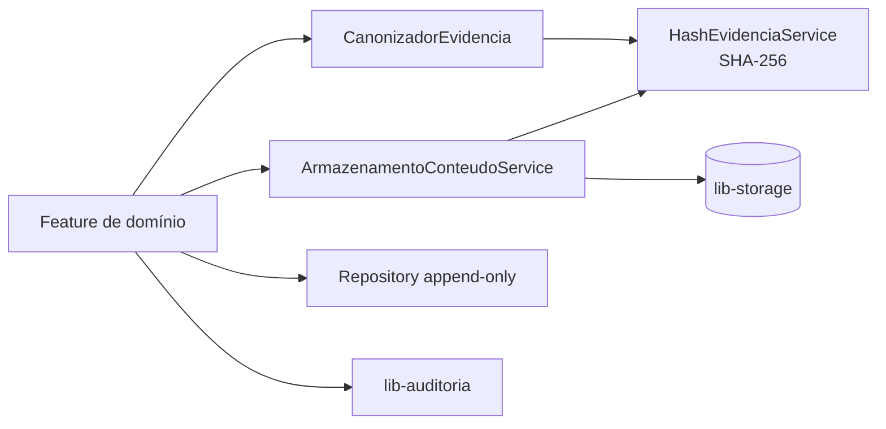

# F-002 — Design

> Spec: [spec.md](spec.md) · Tarefas: [tasks.md](tasks.md)

## Visão geral

Um pequeno núcleo em `service/evidencia` que as features consomem: canonicalização + hash,
armazenamento de conteúdo com hash e uma convenção de repository append-only verificada por teste
de arquitetura. Auditoria de ações via `lib-auditoria`.

## Componentes por camada

| Camada | Classe | Responsabilidade | Atende |
|---|---|---|---|
| service | `CanonizadorEvidencia` | Serializa o registro em forma canônica: campos ordenados, datas em ISO-8601 UTC, decimais com escala fixa, nulos explícitos | RF-01 |
| service | `HashEvidenciaService` | SHA-256 hex da forma canônica | RF-01, RN-02 |
| service | `ArmazenamentoConteudoService` | Grava conteúdo na `lib-storage`, devolve `ReferenciaConteudo(chave, hash)`; leitura com auditoria | RF-02, RF-05 |
| service | `MascaradorDestino` | Máscara de telefone/e-mail para consultas | RF-05 |
| repository | `RepositorioAppendOnly<T, ID>` | Interface base que expõe só `save` (inserção) e consultas; entidades de evidência sem setters públicos após criação | RF-03 |
| test | `EvidenciaArquiteturaTest` (ArchUnit) | Falha se repository de evidência herdar `CrudRepository`/`JpaRepository` com delete, ou declarar `delete*`/`update*`/`@Modifying` | RNF-01 |
| config | integração `lib-auditoria` | Anotações/eventos de auditoria nas ações do RF-04 | RF-04 |

## Contratos

- `ReferenciaConteudo` (embeddable): `chaveStorage`, `hashConteudo`, `tipoConteudo`, `tamanho`.
- Campo `hash` (CHAR(64)) em toda entidade de evidência; calculado **antes** do insert, sobre a forma
  canônica incluindo `ReferenciaConteudo.hashConteudo`.
- Registro de correção: campo `corrigeId` (FK para o registro original).

## Decisões locais

| ID | Decisão | Alternativa descartada |
|---|---|---|
| DL-01 | Canonicalização própria (Jackson com `ORDER_MAP_ENTRIES_BY_KEYS` + `SORT_PROPERTIES_ALPHABETICALLY`) | JSON Canonicalization Scheme completo (RFC 8785): mais pesado, sem ganho aqui |
| DL-02 | Append-only garantido por interface restrita + ArchUnit | Trigger no banco: exigiria SQL divergente Oracle/PostgreSQL; pode ser acrescentado depois |
| DL-03 | Entidades de evidência herdam `EntityAudit` (multitenant/auditoria), mas não são alteradas após o insert; `@Version` fica inerte | Entidade fora da hierarquia do core: perderia `@Multitenant` |

## Riscos

- `EntityAudit` com `@Version` pode incentivar `save` de atualização: o ArchUnit + ausência de setters mitigam.
- Mudança futura na forma canônica invalida hashes antigos → versionar o algoritmo (`versaoCanonizacao` no registro).
