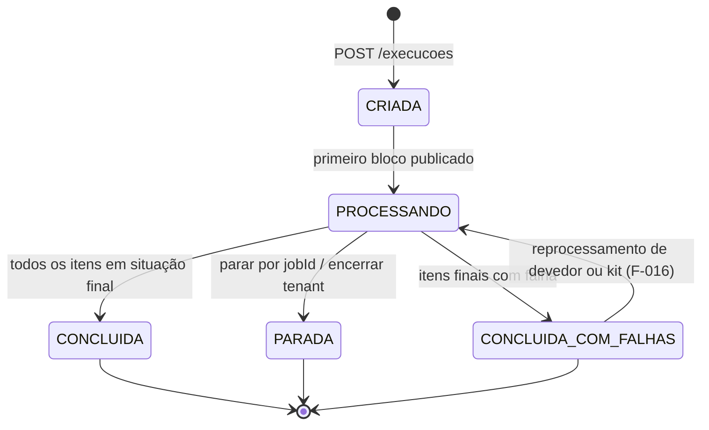

# F-003 — Design

> Spec: [spec.md](spec.md) · Tarefas: [tasks.md](tasks.md)

## Visão geral

Item = **etapa + status** (`ARCHITECTURE.md` A21). Etapas: `QUALIFICACAO_DEVEDOR`, `QUALIFICACAO_DIVIDA`,
`REGUA` (só notificação), `AGRUPAMENTO`, `GERACAO_COBRANCA`. Status:

| Status | Significado | Efeito |
|---|---|---|
| `SUCESSO` | a etapa concluiu | avança para a próxima etapa; na última, é o fim com sucesso |
| `ERRO` | algo deu errado, mas pode ser corrigido | continua até o agrupamento (`DESCARTAR_AUTOMATICAMENTE_DIVIDAS_INVALIDAS_DO_KIT_HABILITADO`, F-011 RN-06); reprocessável por devedor ou kit (F-016) |
| `AVISO` | não há o que fazer, é só um aviso | continua até o agrupamento, como o `ERRO`; reprocessar não resolve |
| `DESCARTADO` | saiu da execução, com motivo | final; libera a reserva |

Precedente do marcador que segue até o agrupamento: `kitcobranca` `ResultadoProcessamentoDivida` (`INTEGRA`/`ERRO`/`ALERTA`).

## Componentes por camada

| Camada | Classe | Responsabilidade | Atende |
|---|---|---|---|
| controller | `ExecucaoController` | `POST /execucoes`, `GET /execucoes/{id}`, `GET /execucoes/{id}/situacao`, `POST /execucoes/parar?jobId`, `POST /execucoes/encerrar` | RF-06, RF-07, RF-08 |
| component | `IniciarExecucaoComponent` | Valida privilégios, cria execução e snapshot, delega o início do processamento (F-004) | RF-01, RF-02, RF-09 |
| component | `PararExecucaoComponent` | Parada por job e encerramento do tenant | RF-08 |
| service | `ExecucaoService` | Criação, transições de situação, contadores | RF-01, RF-10 |
| service | `SnapshotCriteriosService` | Serializa critérios, calcula hash (F-002), grava autor/data | RF-02 |
| service | `PrioridadeExecucaoService` | Deriva `prioritaria` dos critérios/origem | RF-03 |
| service | `ReservaCobrancaService` | Reserva com restrição única, válida enquanto a execução estiver ativa (liberada no `DESCARTADO`, ao terminar a execução e, na notificação, no primeiro aviso válido — F-008); colisão ⇒ item `DESCARTADO` ("dívida em outra execução"); ao reservar um bloco, desfaz kits `INVALIDO` de execuções encerradas que contenham essas dívidas (F-016 RF-11); transferência de notificação para bypass/excepcional | RF-05, RN-03, RN-04, RN-05 |
| repository | `ExecucaoRepository`, `ItemExecucaoRepository`, `ReservaCobrancaRepository` | Persistência | — |
| mapper | `ExecucaoMapper` | Entity ↔ DTO | — |
| entity | `Execucao`, `ItemExecucao`, `ReservaCobranca` | Ver tabelas abaixo | — |
| dto | `CriteriosExecucaoDto` (espelha `CriteriosCobranca` do `agendador` + flags), `ExecucaoDto`, `SituacaoExecucaoDto` | Contratos | RF-06, RF-07 |

## Contratos

### REST

| Método | Caminho | Privilégio | Corpo/resposta |
|---|---|---|---|
| POST | `/execucoes` | disparo; + bypass se manual com flag | `CriteriosExecucaoDto` → `{ id }` |
| GET | `/execucoes/{id}` | consulta | `ExecucaoDto` |
| GET | `/execucoes/{id}/situacao` | consulta | `SituacaoExecucaoDto` (formato compatível com o polling de `CobrancaJob.java:114-148`) |
| POST | `/execucoes/parar?jobId=` | disparo | 204 |
| POST | `/execucoes/encerrar` | administração do tenant | 204 |

Nomes de privilégio definidos na implementação seguindo `lib-security` (ADR java 0005).

### Tabelas (multi-banco)

| Tabela | Colunas principais | Índices/restrições |
|---|---|---|
| `execucao` | id, tenant, fase, origem, prioritaria, criterios (CLOB), criterios_hash, bypass_notificacao, bypass_protesto, regua_id, estrategia_empacotamento, job_id, autor, situacao, contadores | (tenant, situacao), (tenant, job_id) |
| `item_execucao` | id, tenant, execucao_id, devedor_id, divida_id, etapa, status, motivo, kit_id | (tenant, execucao_id, status), (tenant, divida_id) |
| `reserva_cobranca` | id, tenant, divida_id, item_execucao_id | **único (tenant, divida_id)** — a linha existe só enquanto o item está ativo |

Reserva modelada como linha que é **apagada** ao liberar: é estado operacional, não evidência
(a trilha fica na auditoria e no item).
O passo atual da régua é do **kit** de notificação (A23), não do item — a coluna mora na tabela do kit (F-011/F-008).

## Decisões locais

| ID | Decisão | Alternativa descartada |
|---|---|---|
| DL-01 | Reserva como tabela com unique (tenant, divida_id) e delete na liberação | Índice único parcial (`WHERE ativo`): não portável para Oracle |
| DL-02 | Critérios em CLOB + hash, com colunas próprias só para o que é filtrado (fase, bypass, job) | Colunas para todos os critérios: acopla ao contrato do `agendador` |
| DL-03 | Transferência de reserva (RN-04) numa única transação: marca item da notificação como `DESCARTADO` (motivo "encaminhada pela execução X") e move a reserva | Duas transações: janela em que a dívida fica sem dono |

## Riscos

- Formato exato do polling do `agendador` precisa ser espelhado — conferir `CobrancaJob.java` na implementação.
- Contrato de critérios depende de E-05; implementar contra o DTO acordado e ajustar quando o `agendador` publicar.
