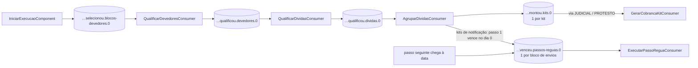

# F-004 — Design

> Spec: [spec.md](spec.md) · Tarefas: [tasks.md](tasks.md)

## Visão geral

**Um tópico por etapa** (cada um com a variante `.prioritario`), com consumer próprio (DL-01, 28/09/2026). Os
tópicos são **fatos** (ADR comum 0005: `cmd` só quando não há fato na origem): cada etapa publica o que aconteceu
(`qualificou.devedores`, `montou.kits`…) e a etapa seguinte assina esse fato (DL-04). O consumer de gerar cobrança
filtra a via do kit (fato publicado para todo kit; a filtragem é no consumer). É a
correção do problema do `kitcobranca`, em que um tópico só para todos os blocos fazia uma etapa lenta limitar a
vazão das outras: com tópico próprio, cada etapa tem fila, vazão e concorrência independentes, e o consumer não
precisa despachar por etapa.

## Componentes por camada

| Camada | Classe | Responsabilidade | Atende |
|---|---|---|---|
| messageria | `MessageService` (interface) / `MessageServiceImpl` | Publica bloco/kit escolhendo tópico padrão ou prioritário pela execução | RF-01, RF-04, RN-01 |
| messageria | `QualificarDevedoresConsumer` (+ variante prioritária) | Consome `…selecionou.blocos-devedores.0`, checa execução parada e delega a `QualificacaoDevedorComponent (F-005)`; ao concluir, publica no tópico da etapa seguinte | RF-01, RF-02, RN-02 |
| messageria | `QualificarDividasConsumer` (+ variante prioritária) | Consome `…qualificou.devedores.0`, checa execução parada e delega a `QualificacaoDividaComponent (F-006)`; ao concluir, publica no tópico da etapa seguinte | RF-01, RF-02, RN-02 |
| messageria | `AgruparDividasConsumer` (+ variante prioritária) | Consome `…qualificou.dividas.0`, checa execução parada e delega a `AgrupamentoComponent (F-011)`; ao concluir, publica no tópico da etapa seguinte | RF-01, RF-02, RN-02 |
| messageria | `ExecutarPassoReguaConsumer` (+ variante prioritária) | Consome `…venceu.passos-reguas.0`, checa execução parada e delega a `PassoReguaComponent (F-008)`; o passo seguinte da régua volta a este tópico quando chega a sua data | RF-01, RF-02, RN-02 |
| messageria | `GerarCobrancaKitConsumer` (+ variante prioritária) | Consome `…montou.kits.0`, ignora kit de via `NOTIFICACAO` e delega à F-012 | RF-03 |
| service | `ControleBlocoService` | Registra bloco processado (idempotência) e atualiza contadores agregados | RF-05, RF-07 |
| service | `ParametrosProcessamentoService` | Lê tamanho de bloco e concorrência via `lib-parametro` | RF-06 |
| entity | `BlocoProcessado` | (execucao_id, etapa, numero_bloco) único | RF-05 |
| config | `KafkaConsumerConfig` | Container factories padrão e prioritária com concorrência parametrizada | RF-04, RF-06 |

## Contratos

### Tópicos

| Tópico | Chave | Payload |
|---|---|---|
| `cobranca-dividaativa.selecionou.blocos-devedores.0` / `cobranca-dividaativa.selecionou.blocos-devedores.prioritario.0` | `execucaoId` + chave de partição (devedor/raiz CNPJ quando aplicável) | `BlocoEtapaMensagem{execucaoId, numeroBloco, itemIds \| cursor}` |
| `cobranca-dividaativa.qualificou.devedores.0` / `….qualificou.devedores.prioritario.0` | `execucaoId` + chave de partição (devedor/raiz CNPJ quando aplicável) | `BlocoEtapaMensagem{execucaoId, numeroBloco, itemIds \| cursor}` |
| `cobranca-dividaativa.qualificou.dividas.0` / `….qualificou.dividas.prioritario.0` | `execucaoId` + chave de partição (devedor/raiz CNPJ quando aplicável) | `BlocoEtapaMensagem{execucaoId, numeroBloco, itemIds \| cursor}` |
| `cobranca-dividaativa.montou.kits.0` / `….montou.kits.prioritario.0` | `kitId` | `KitMensagem{execucaoId, kitId, via}` |
| `cobranca-dividaativa.venceu.passos-reguas.0` / `….venceu.passos-reguas.prioritario.0` | `execucaoId` | `BlocoEtapaMensagem{execucaoId, numeroBloco, kitIds}` |

Payload leve (ids), sem repetir o que MDC/headers já propagam (ADR comum 0005). A variante prioritária leva
`.prioritario` **antes** da versão, como no legado (`cobranca.cmd.cobrar-devedores.prioritario.0`). Como o passo
seguinte da régua chega à sua data e vira `venceu.passos-reguas` fica para o design da F-008 (pela ADR java 0021, um
job do `agendador`).

### Tabela

| Tabela | Colunas | Restrição |
|---|---|---|
| `bloco_processado` | id, tenant, execucao_id, etapa, numero_bloco, processado_em | único (tenant, execucao_id, etapa, numero_bloco) |

### Parâmetros (catálogo no `admin`, E-10)

| Id | Tipo | Padrão proposto |
|---|---|---|
| `TAMANHO_BLOCO_EXECUCAO_COBRANCA` | inteiro | 500 |
| `CONCORRENCIA_CONSUMIDOR_COBRANCA` | inteiro | a definir na medição (F-019) |

Concorrência de container Kafka é fixada no startup; "por tenant" vale para o tamanho do bloco. A
concorrência entra como propriedade de deploy, com o parâmetro servindo de referência. Registrado
como DL-02.

## Decisões locais

| ID | Decisão | Alternativa descartada |
|---|---|---|
| DL-01 | **Um tópico por etapa** (+ `.prioritario`), consumer próprio por etapa (28/09/2026) | Um tópico de bloco com a etapa no payload: é o desenho do `kitcobranca`, em que uma etapa lenta limita a vazão de todas |
| DL-02 | Concorrência como propriedade de deploy; tamanho do bloco por parâmetro de tenant | Concorrência por tenant: containers Kafka não mudam concorrência por mensagem |
| DL-04 | Tópicos entre etapas como **fatos** (`selecionou`, `qualificou`, `montou`, `venceu`), não `cmd` (ADR comum 0005, 28/09/2026) | `cmd` por etapa (precedente do legado): a ADR restringe `cmd` a quando não há fato na origem |
| DL-03 | Idempotência por tabela `bloco_processado` inserida na mesma transação do efeito | Deduplicação em cache: perde garantia em restart |

## Riscos

- Partição por devedor com raiz de CNPJ exige que a chave seja calculada antes do agrupamento (F-011).
