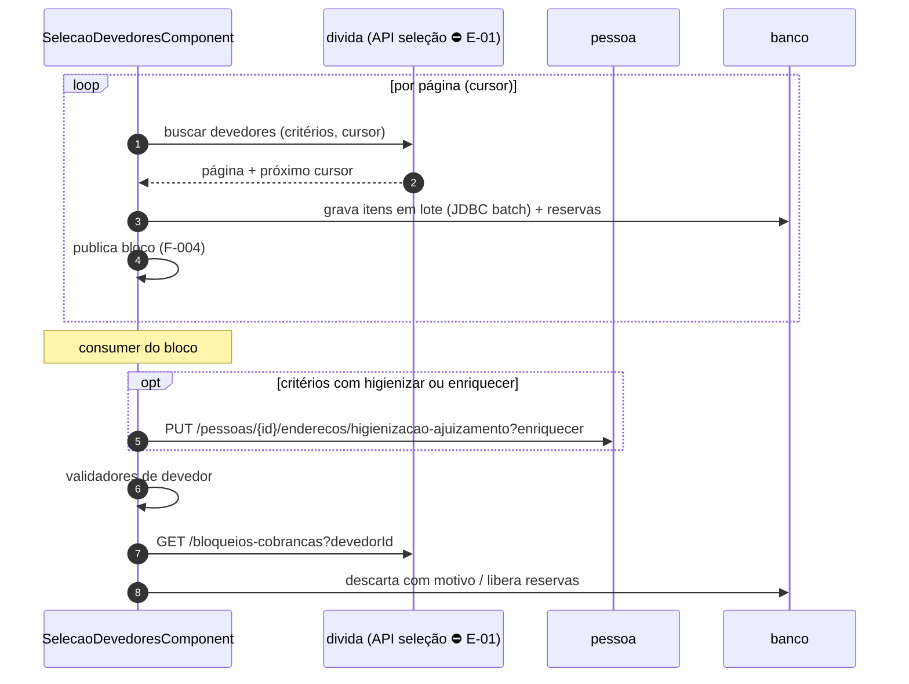

# F-005 — Design

> Spec: [spec.md](spec.md) · Tarefas: [tasks.md](tasks.md)

## Visão geral

## Componentes por camada

| Camada | Classe | Responsabilidade | Atende |
|---|---|---|---|
| component | `SelecaoDevedoresComponent` | Paginação, gravação em lote, publicação de blocos; no consumer, atualização + validação | RF-01, RF-02 |
| service | `ValidadorDevedor` (interface) | Contrato `validar(devedor) → Optional<MotivoDescarte>` + `cobertoPelaConsulta()` | RN-03 |
| service | `ValidadorDocumentoDevedor` | CPF/CNPJ via `StringUtil` (ADR java 0017) | RF-04, RN-01 |
| service | `ValidadorBloqueioCobrancaDevedor` | Consulta bloqueio no `divida` | RF-05, RN-02 |
| service | `ValidadorEnderecoDevedor` | Endereço principal presente, com município e válido para citação (salvo passível de ajuizamento); só nas fases `PROTESTO`/`AJUIZAMENTO` e com `VALIDAR_ENDERECO_CONSISTENTE_GERACAO_KIT_AJUIZAMENTO` habilitado. Portar a regra do `divida` (C5) conferindo o código antes (ADR agente 0011) | RF-08, RN-04 |
| service | `ValidadorCriteriosDevedor` | Tipo de pessoa, valor mínimo ajuizado, situação PJ; `cobertoPelaConsulta() = true` (só roda após atualização) | RF-09, RN-05 |
| service | `AtualizacaoDevedorService` | Chama o `pessoa` quando os critérios trazem `higienizar` ou `enriquecer` | RF-03 |
| service | `ConciliadorListaInformada` (compartilhado com a F-006) | Execução com lista explícita de devedores: compara os documentos informados com o resultado da consulta; para os ausentes, busca por documento **sem filtros** e reaplica `ValidadorCriteriosDevedor` para achar o motivo; sem critério falho ⇒ "sem dívidas aptas para a fase"; não encontrado ⇒ "devedor não encontrado". Grava item `DESCARTADO` sem reserva, guardando o **documento informado** (o devedor pode não existir) | RF-10, RN-09 |
| service | `DescarteItemService` | Marca `DESCARTADO(motivo)`, libera reservas, soma contador | RF-06, RF-07 |
| client | `DividaSelecaoClient` (Feign) | API de seleção paginada | RF-01 |
| client | `DividaBloqueioClient` (Feign) | `GET /bloqueios-cobrancas?devedorId` | RF-05 |
| client | `PessoaClient` (Feign) | `PUT /pessoas/{id}/enderecos/higienizacao-ajuizamento?enriquecer` (existente, `pessoa` `EnderecoController.java:97`) | RF-03 |
| dto | `PaginaDevedoresDto`, `DevedorSelecionadoDto`, `MotivoDescarte` (enum) | Contratos | — |

## Contratos

- **Seleção (proposta para E-01):** `POST /cobrancas/selecao/devedores` com `{criterios, fase, bypass, cursor, tamanho}` → `{devedores[], proximoCursor}`. Enquanto E-01 não existir, testes usam stub WireMock com este contrato.
- **Busca por documento para conciliação (proposta, parte de E-01):** `POST /cobrancas/selecao/devedores/por-documento` com `{ documentos[≤ tamanho do bloco] }` → dados do devedor (tipo de pessoa, situação, valor ajuizado) **sem** filtros; documento inexistente não retorna.
- **Bloqueio:** `GET /bloqueios-cobrancas?devedorId` (existente, `kitcobranca/.../client/DividaService.java:17`).
- **Consulta:** os critérios de devedor do job (`tipoPessoa`, `valorMinimoAjuizado`, `tipoSituacaoDevedorAjuizamento`) seguem em `criterios` e são aplicados pelo `divida` como filtros (parte do contrato E-01).
- **Atualização do devedor:** `PUT /pessoas/{id}/enderecos/higienizacao-ajuizamento?enriquecer=<bool>` (existente; mesmo uso do `divida`, `client/PessoaService.java:27`). Disparo pelas flags `higienizar`/`enriquecer` dos critérios (`CriteriosSelecaoCobranca` do `divida`), não por parâmetro. Falha na chamada **para o devedor** em `ERRO` com motivo `FALHA_ATUALIZACAO_DEVEDOR` na etapa `QUALIFICACAO_DEVEDOR`, sem consultar as dívidas (como o `divida`, que registra `TipoErro.HIGIENIZACAO_DEVEDOR` e para o devedor); reprocessável pelo devedor (RN-08, 28/09/2026).
- **Motivos de descarte (enum):** `DOCUMENTO_INVALIDO`, `BLOQUEIO_COBRANCA`, `ENDERECO_INCONSISTENTE`, `CRITERIO_DEVEDOR_NAO_ATENDIDO`, `DEVEDOR_NAO_ENCONTRADO`, `SEM_DIVIDAS_APTAS_FASE`, … (falha técnica não é motivo de descarte aqui: `FALHA_ATUALIZACAO_DEVEDOR` marca `ERRO`) (ampliado pelas features seguintes).

### Catálogo de validadores de devedor

| Validador | Fases | Coberto pela consulta? | Condição |
|---|---|---|---|
| Documento (CPF/CNPJ) | protesto, ajuizamento | não | fixo |
| Bloqueio de cobrança | todas | não | fixo |
| Endereço consistente | protesto, ajuizamento | não | `VALIDAR_ENDERECO_CONSISTENTE_GERACAO_KIT_AJUIZAMENTO` |
| Critérios de devedor (tipo, valor mínimo ajuizado, situação PJ) | conforme critérios do job | sim | critério preenchido no job |

Documento e endereço não são exigidos na notificação: o `PROJECT.md` fixa o bloqueio de CPF/CNPJ para protesto e ajuizamento, e o endereço foi decidido para as mesmas fases (DL-04).

## Decisões locais

| ID | Decisão | Alternativa descartada |
|---|---|---|
| DL-01 | Validadores como estratégias com `cobertoPelaConsulta()` | `if` encadeado: não sustenta a regra "sem atualização, só o não coberto" |
| DL-02 | Paginação na execução (produz blocos) e validação no consumer do bloco | Validar durante a paginação: bloqueia a paginação em chamadas remotas |
| DL-03 | Consulta de bloqueio por devedor (contrato existente) | Esperar API em lote: sem precedente; medir em F-019 |
| DL-04 | Cada validador declara as fases em que vale; documento e endereço não valem na notificação | Validar tudo em todas as fases: descartaria da régua devedor que pode ser notificado por SMS/e-mail |

## Riscos

- Consulta de bloqueio é uma chamada por devedor (`ARCHITECTURE.md` §12); se virar gargalo, pedir filtro de bloqueio na própria API de seleção (evolução de E-01).
