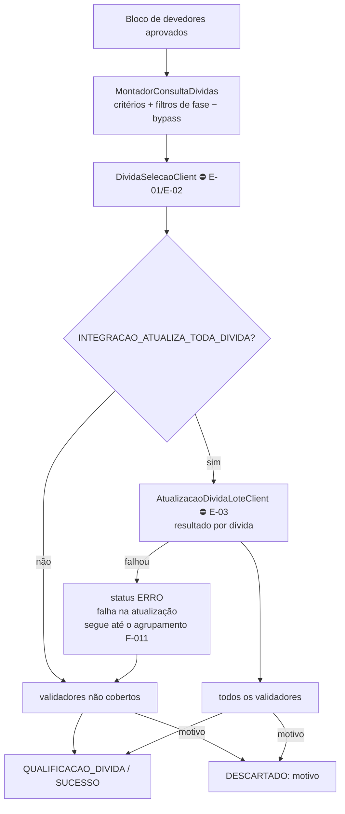

# F-006 — Design

> Spec: [spec.md](spec.md) · Tarefas: [tasks.md](tasks.md)

## Visão geral



## Componentes por camada

| Camada | Classe | Responsabilidade | Atende |
|---|---|---|---|
| component | `SelecaoDividasComponent` | Orquestra consulta → atualização → validação no consumer do bloco | RF-01, RF-08, RF-09 |
| service | `MontadorConsultaDividas` | Traduz execução em filtros: fase, flags de bypass, exclusões fixas (R1), valor mínimo de protesto (R3) | RF-01–RF-04, RF-06, RF-07 |
| service | `AtualizacaoDividaService` | Lê `INTEGRACAO_ATUALIZA_TODA_DIVIDA`, chama o lote, separa sucessos e falhas | RF-08, RN-04 |
| service | `ValidadorDivida` (interface) + implementações `ValidadorPrescricao`, `ValidadorJaAjuizada`, `ValidadorExigibilidadeSuspensa`, `ValidadorBloqueioCobrancaDivida` | Cada um com `cobertoPelaConsulta()` | RF-09, RF-10, RN-02 |
| service | `ConciliadorListaInformada` | Execução com lista explícita: compara a lista com o resultado da consulta; para as ausentes, busca os dados por número **sem filtros de fase** e aplica o catálogo de validadores + condições de fase para achar o 1º motivo; grava item `DESCARTADO` sem reserva | RF-12, RN-06 |
| service | `DescarteItemService` (da F-005) | Descarte com motivo e liberação de reserva | RF-11 |
| client | `DividaSelecaoClient` | Consulta de dívidas com filtros | RF-01 |
| client | `AtualizacaoDividaLoteClient` | Atualização em lote | RF-08 |

## Contratos

### Consulta (proposta para E-01/E-02)

`POST /cobrancas/selecao/dividas`

```json
{
  "devedorIds": ["..."],
  "criterios": { "...": "espelho do job" },
  "fase": "AJUIZAMENTO",
  "exigirNotificacao": true,
  "exigirProtestoOuDispensa": true,
  "valorMinimoProtesto": null
}
```

Nota: `exigirNotificacao=false` quando há `bypassNotificacao`; a notificação não expira (28/09/2026). Exclusões fixas (já ajuizada, protesto `PAGO`/`ENVIADO_PARA_CARTORIO`) são sempre aplicadas pelo `divida`.

### Busca por números para conciliação (proposta, parte de E-01)

`POST /cobrancas/selecao/dividas/por-numero` com `{ numeros[≤ tamanho do bloco] }` → dados indexados de cada dívida
(situação, ajuizamento, protesto e categoria, notificação, dispensa, bloqueio), **sem** filtros de fase; número
inexistente não retorna.

### Atualização em lote (proposta para E-03)

`PUT /dividas/cobranca/lote` com `{ dividaIds[≤ tamanho do bloco] }` → `[{ dividaId, atualizada: bool, erro? }]`.

### Catálogo de validadores

| Validador | Coberto pela consulta? | Motivo de descarte |
|---|---|---|
| Situação da dívida (aberta) | sim | — |
| Já ajuizada (salvo extinção sem mérito) | sim | `JA_AJUIZADA` |
| Protesto `PAGO`/`ENVIADO_PARA_CARTORIO` | sim | `PROTESTO_PAGO_OU_EM_CARTORIO` |
| Prescrição | sim, se o critério de prescrição foi para a consulta | `PRESCRITA` |
| Exigibilidade suspensa | sim | `EXIGIBILIDADE_SUSPENSA` |
| Bloqueio de cobrança da dívida | **não** | `BLOQUEIO_COBRANCA` |
| Já em régua (só `NOTIFICACAO`) | **não** (dado local) | `JA_EM_REGUA` |
| Falha na atualização | — | não descarta: marca `ERRO` com motivo `FALHA_ATUALIZACAO`; decisão no agrupamento (F-011 RN-06) |

A coluna "coberto" é revisada quando o contrato final de E-01 for publicado.

## Decisões locais

| ID | Decisão | Alternativa descartada |
|---|---|---|
| DL-01 | Filtros de fase montados aqui e enviados como flags explícitas (`exigirNotificacao`, `exigirProtestoOuDispensa`) | Enviar só a fase e deixar o `divida` deduzir: esconde a regra do gate em outro serviço |
| DL-02 | ~~Data limite de validade~~ — removida em 28/09/2026 (notificação não expira) | — |
| DL-03 | Validadores com marcação de cobertura revisável | Validar tudo sempre: contraria R5 e custa chamadas |
| DL-04 | Motivo da dívida informada ausente calculado **neste serviço**, reaplicando o catálogo de validadores e as condições de fase sobre os dados buscados sem filtro (RF-12) | Pedir o motivo ao `divida`: a consulta ES não sabe por que excluiu; espalharia a regra do gate em outro serviço (DL-01) |

## Riscos

- A ordem do catálogo define o motivo exibido quando a dívida falha em vários critérios; seguir a ordem do legado (inventário `cobranca` C17) para paridade.

- Índice do `divida` defasado pode trazer dívida inapta; a F-010 reconfirma antes do kit (não aqui).
- Se E-03 atrasar e algum tenant tiver `INTEGRACAO_ATUALIZA_TODA_DIVIDA` ligado, a virada desse tenant fica bloqueada.
